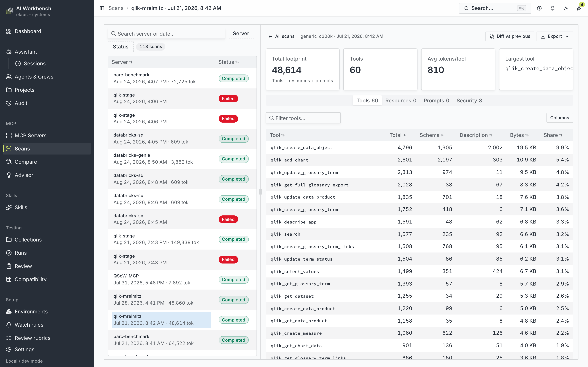
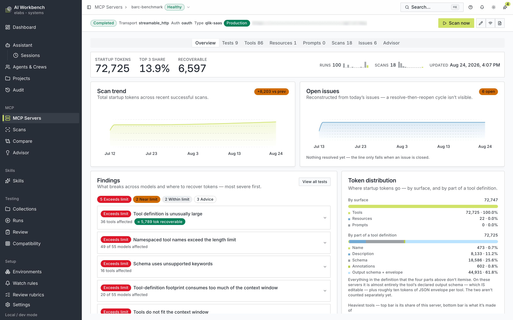
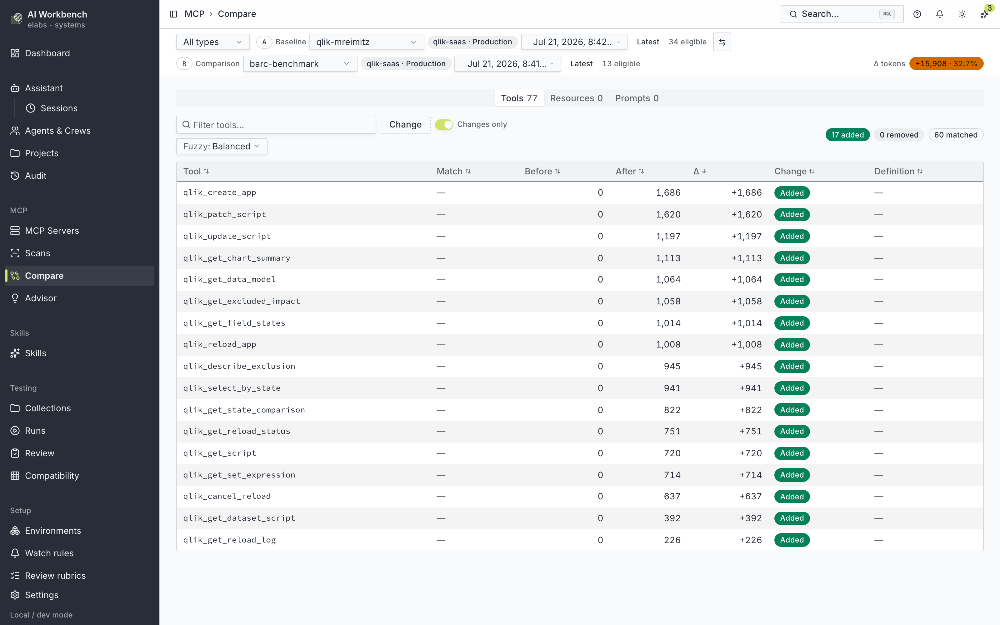
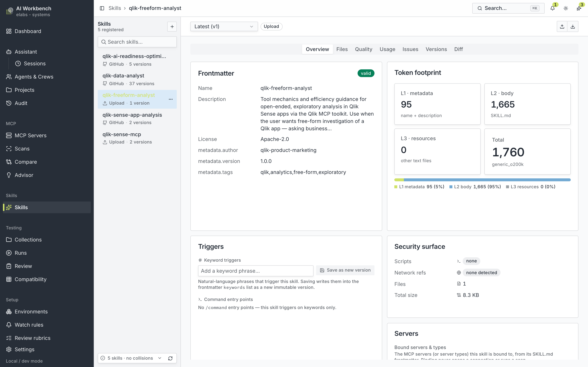
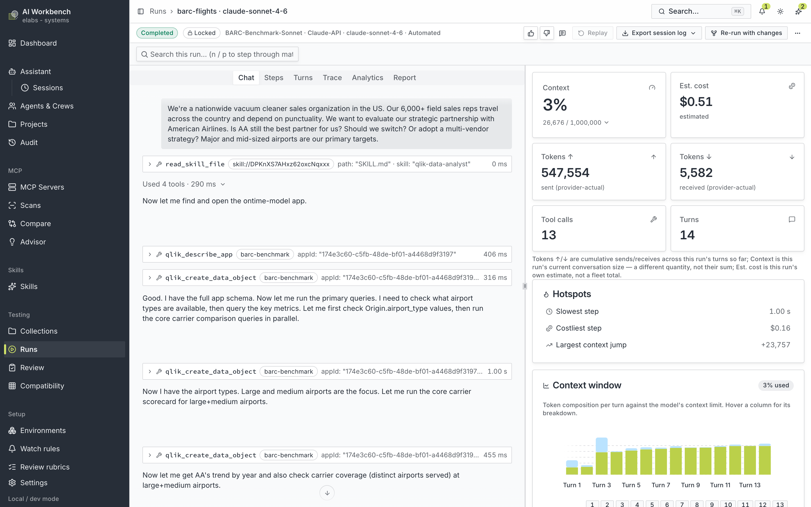
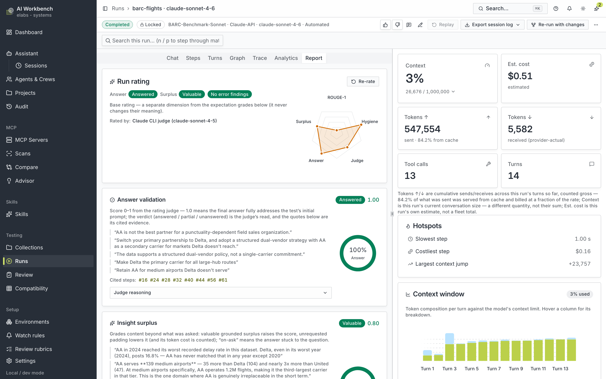
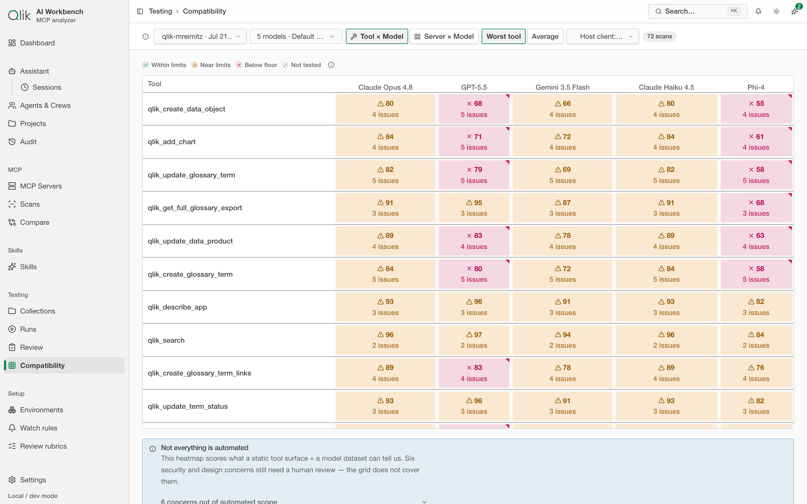
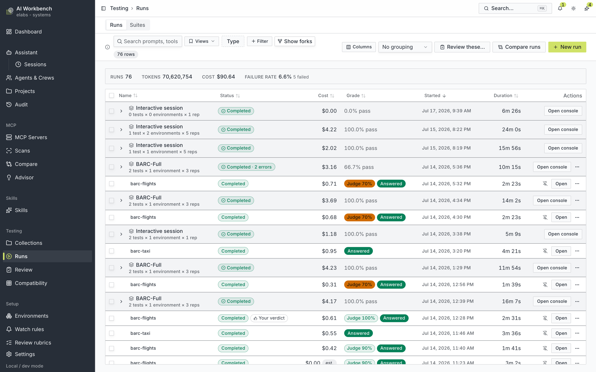
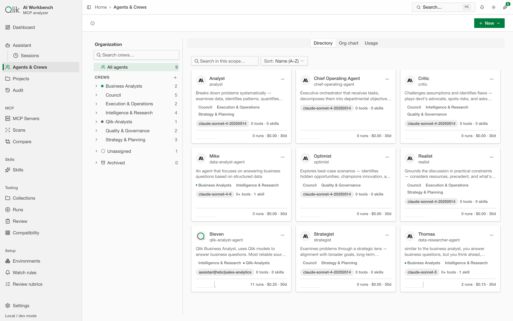
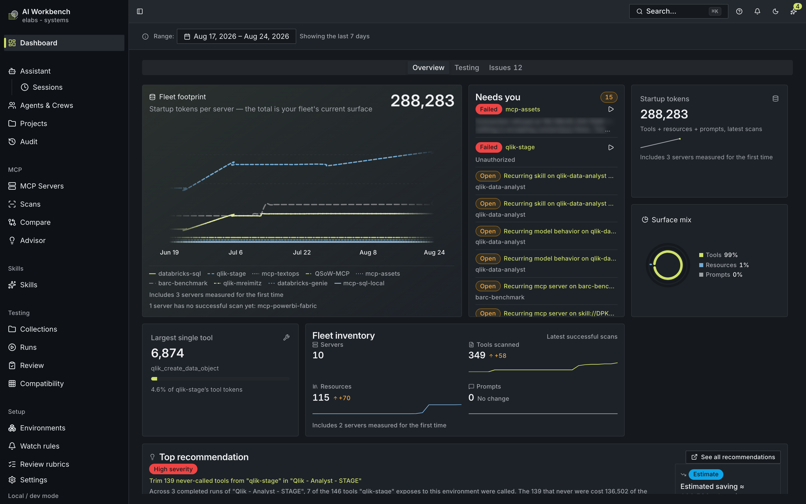

# AI Workbench

**A local workbench for understanding, testing, and validating how MCP servers and Agent Skills
behave inside real AI sessions — what they cost, where they break, and how to fix them.**

*(This is the **`mcp-token-footprint`** repository. The product began as a token-footprint analyzer
and grew into a full session workbench — which is how it now presents itself in-app: **AI Workbench —
MCP analyzer**. The two names refer to the same thing.)*


> Runs entirely on your machine · one Docker container on port `8080` · React 19 + Fastify +
> SQLite · connects to MCP servers over stdio and streamable HTTP · drives them through real
> multi-provider LLM agent loops. No accounts, no cloud.

---

## What it is

An **AI session** is where everything comes together: the model, the MCP servers that give it tools,
and the Agent Skills that give it instructions. Each of those adds to the model's limited context
and shapes how the assistant behaves. When a session is slow, expensive, or simply gives the wrong
answer, the cause is usually buried in that interaction.

AI Workbench brings it into the open — **measured, reproducible, and testable** — so you can
move from "something feels off" to a concrete, verified fix. Connect to one server or many, extract
their entire tool surface, count what those definitions actually cost a model, run the server through
a live agent loop, watch the session play out turn by turn, have every run **automatically graded**
for what went wrong and why, and compare any two things: a server against its own past, two servers
against each other, or two sessions side by side.

Your servers, your credentials, and your data never leave the machine. Secrets are encrypted before
they touch the database and are never returned by the API.

## Who it's for

- **Operators & end users** — see how your skills and servers fit together, what each one costs in
  context, and how a session actually unfolds. Stop guessing about why an assistant behaves the way
  it does.
- **Presales, CSEs & technical field teams** — understand a session end to end, pinpoint exactly
  where an issue is, and demo or support from evidence instead of intuition.
- **Skill & MCP developers** — automated issue detection plus a closed test-and-fix loop turn
  "something's wrong" into a reproducible problem and a proven fix, without leaving the app.
- **MCP server owners** — analyze and validate your servers, track how they evolve, and run
  long-running quality gates so regressions are caught before they reach a user.

## What sets it apart

- **Real measurement, not estimates.** It counts the actual context cost of tools, skills, and live
  calls the way a model does — with real tokenizer BPE, over the serialized payload that is actually
  sent to the model.
- **Sessions, not just definitions.** It shows skills and servers *working together* in a real agent
  session, not only their static descriptions.
- **Automatic issue detection.** Every terminal run is reviewed automatically — did it answer the
  question, was the surplus valuable, what errored and why — so problems surface without a manual hunt.
- **Closed-loop test-and-fix.** A failing run can file a tracked issue against the skill or server
  involved, with a drafted fix you can apply yourself or hand to the built-in Assistant — then re-run
  and verify.
- **Compare anything.** Diff a server against its own history, two servers against each other, two
  runs turn by turn, or two agent configurations head-to-head.
- **Operable by machines, not just by you.** Everything it measures is reachable over MCP, from a
  terminal, and from a build pipeline — with a permission model, honest exit codes, and a gate that
  can fail a pull request on footprint, quality, or security posture.
- **Fully local.** Everything runs on your machine, so sensitive setups and credentials never leave it.

---

## Take the tour

### 1 · Connect servers and measure their footprint

Add an MCP server (stdio command or streamable-HTTP URL), test the connection, and run a **discovery
scan**: `initialize` + `tools/list` (names, descriptions, input schemas, annotations) plus
`resources/list` and `prompts/list`. Every tool is ranked by how many tokens its definition costs a
model — broken down into schema, description, and raw bytes, with each tool's share of the total.

Token counting uses **real `js-tiktoken` BPE** for the `o200k` and `cl100k` families (rank data
bundled, so it works offline), plus two heuristic profiles for quick estimates. A tool's total is
the count of the **serialized provider payload** actually sent to a model — not the sum of isolated
facets — and every scan is stamped with a counting version so results from different methods are
never silently compared.



**MCP Servers**, **Skills** and **Collections** each open as an overview of everything you have
registered — a grid of cards grouped by type (or by source, or by whether a collection is bound to a
git repo), switchable to a grouped table and remembered per section. Selecting one opens its
full-width detail page, where the last breadcrumb is a searchable switcher over every other one, so
moving between servers costs a click rather than a permanent column. (The screenshots below still
show the previous side-list layout.)

### 2 · Server health, findings, and token advice

Each server has its own home with a footprint summary, a per-tool token distribution, and
**evidenced findings** ranked by severity — the heaviest tools, names that risk hitting length
limits, schemas using unsupported keywords, definitions that crowd a model's context window — each
with a concrete recovery and an estimate of the tokens you'd get back.



### 3 · Compare — over time and across servers

Track a server against its own previous scans (added / removed / changed tools, token deltas), or put
two **different** servers side by side. Tool-level comparison matches tools exact → normalized →
fuzzy, so you can see the same tool across servers and exactly how their token costs differ.



### 4 · Skills — register, inspect, attach

Register an [Agent Skill](https://agentskills.io) by uploading a `.zip`/`SKILL.md` or importing a
GitHub repo, version it, and inspect its **L1/L2/L3 token footprint**, its rendered `SKILL.md`, its
triggers and command entry points, and a **security surface** (script files and languages, network
references, file and byte totals). Skills can be attached to test scenarios — exposed to the agent
read-only and metered, **never executed**.



### 5 · The testing console — real agent sessions

Drive a server through a **real LLM agent loop** across multiple providers and watch the whole
session: the conversation, every tool call and result, a live KPI rail (context used, estimated cost,
tokens sent/received, tool calls, turns), hotspots (slowest and costliest steps, largest context
jump), and a per-turn context-window chart. Runs are fully persisted, so any run replays exactly.



### 6 · Automatic run rating

Every terminal run is graded automatically — **answer validation** (did the final answer address the
prompt, with cited evidence), **insight surplus** (was the extra content valuable or just padding),
and **error forensics** (root-cause buckets and fix targets) — using a Claude-CLI-first judge chain
that falls back to a provider judge or deterministic graders. It's a separate dimension from
expectation grades and never changes their meaning.



### 7 · MCP × model compatibility

See how a server's tool surface holds up across models. The heatmap scores every tool (or the whole
server) against a roster of models — within limits, near limits, below the floor, not tested — with
per-cell issue counts, and is honest about the concerns that still need a human review.



### 8 · The runs feed — your session fleet

Every run and suite-run in one searchable, filterable feed with running totals (tokens, cost, failure
rate). Suite-runs expand into their member sessions; drill into any one to open its console. Runs can
be compared, reviewed, and turned into repeatable suites.



### 9 · The Assistant and the multi-agent Hub

A built-in **App assistant** dock operates the current page on your behalf — analyze this scan,
triage this failed run, edit this skill into a new version (approval-gated). Alongside it, a
full-page **Assistant Hub** is a general-purpose, multi-model workspace: chat, citations-first
research, and **missions**, where a planner proposes a team of subagents (roles, models, tool grants,
budgets) that run in parallel and synthesize a cited answer. Saved agents and crews live in a
directory you can browse, reuse, and cost-track.

The two are **separate switches** in Settings › Features — *App assistant* for the dock, *Assistant
workspace* for the Hub — so you can run either one without the other.



### 10 · The bench itself, MCP-operable

The workbench serves **its own MCP server** at `/api/mcp` (streamable HTTP), so an outside agent — a
Claude Code session, a Cursor window, a CI job — works with what the bench has measured without a
browser: servers and scans with per-tool footprints, runs with their grades and reports, skills with
their footprint and security surface, suites, collections and compatibility. With an explicitly
scoped token it can also *act* — scan a server, start a suite, launch a run plan — and it can never
delete anything. It returns no secret values and lives behind a Settings › Features switch.

Point a host at `http://127.0.0.1:8080/api/mcp`, or read the usage page it generates for itself at
[`/api/mcp/llms.txt`](http://127.0.0.1:8080/api/mcp/llms.txt). We hold it to our own standard:
`pnpm mcp:self-scan` points the app's discovery scanner at its own mount and fails if the tool
definitions exceed their budget (currently **24 tools · 3,183 tokens** against a 3,500 budget).

**This is one of three ways to drive the bench without opening it — see
[Drive it without a browser](#drive-it-without-a-browser) below.**

### 11 · Security posture

Every scan and every skill version carries a **Security** tab: findings ranked worst-first, each
naming the rule that fired, what it fired on, and the matched evidence — with invisible characters
made visible and anything credential-shaped masked before it reaches the screen. A 0–100 score and a
risk band sit above them, and the servers list carries a posture badge per server so a fleet-level
problem is visible before you drill in.

Eighteen deterministic rules run over data the app has **already stored** — no MCP call, no skill
execution, no network. Eleven look at a server's tool surface: injection phrasing and hidden
instruction blocks in descriptions, invisible unicode, annotations that contradict the tool they
describe, credential-shaped parameters, unconstrained schemas, and OAuth grants broader than the job
needs. Seven look at a skill: the same steering heuristics over `SKILL.md`, a credential committed
into the body, a wildcard `allowed-tools` grant, and the scripts and network references it ships.

Pick an older scan or version as a baseline and the tab becomes a **diff** — what was added, what was
resolved, what carries over. It refuses rather than guesses: two different servers, a server against
a skill, two different analyzer versions, or a truncated report each get an explanation instead of a
misleading answer. The same comparison backs the `no-new-security-findings` CI gate, so the page and
the pull request can never tell you different stories.

Exported **scan and server reports** carry the same posture — score, band, analyzer version, counts,
findings and evidence — in both JSON and Markdown, in a fixed shape you can grep. A server whose scan
failed still exports: its posture section says `Not analysed: … — unmeasured, not clean` rather than
failing the download or quietly reading as a clean bill of health.

### 12 · Illustrations — the asset repository

`/illustrations` is a catalog of the app's own isometric illustrations, and the drawings on it are
**live components**, not exported images: an MCP server, a skill and an LLM agent, drawn in whatever
theme the app is currently wearing. Switch the theme and the whole page repaints, because not one of
them names a colour — every fill and stroke is a token bound to the theme by a single mapping file.

Opening one shows it at every **state** (idle, active, highlight, dimmed, error), at all three
**footprints** framed against one box so the scale difference is the real one, at each of its
**variants** (a server drawn as stdio or as streamable-HTTP), facing upstream and downstream, and its
catalog entry — ports, keywords, tier, registry version. A **port overlay** toggle marks the named
attachment points a future scene would connect.

A second tab shows the drawing vocabulary the entities are composed from: the paper stage, the
platform and housing solids, the glyph frame, the construction ghost, the six connector kinds and
the calibration cube.

This is the foundation, not the finished system. There is **no scene composition yet** — the
declarative scene spec, the step-by-step explainers, and describing a workflow to the assistant and
getting a diagram back are all still planned. Route only, no nav item: reach it by typing the address
(the breadcrumb's Home is the way back out).

> **Also on board:** export any scan, server, or run as **JSON or Markdown**.
> See the [user guide](planning/user-guide/DC-01-getting-started/00-guide-map.md) for the full picture.

### Two themes

The whole app is built on the upstream `@elabs-ai/components-*` design system and reads correctly in **Light**
and **Dark**, with a **System** option that follows your OS preference. Switch it in Settings or
the top bar.



---

## Drive it without a browser

Everything the bench measures is reachable three ways, and they all go through the same API, so they
all give the same numbers. Pick by who is asking.

| You want… | Use | Guide |
| --- | --- | --- |
| an **AI agent** to read and operate the bench | the **MCP mount** at `/api/mcp` | [Workbench agent playbook](planning/user-guide/DC-16-workbench-mcp-server/20-workbench-mcp-server.md) |
| to script it from a **terminal** | the **`mcpfp` CLI** | [The mcpfp CLI](planning/user-guide/DC-18-mcpfp-cli/22-mcpfp-cli.md) |
| a **pull request** to fail on a regression | a **gate file** + the CLI | [Gating a pull request](planning/user-guide/DC-19-ci-github-actions/23-ci-github-actions.md) |

### An agent can read — and, if you let it, act

The mount exposes 24 tools. Twenty-one are reads, covering the whole surface an agent needs to answer
"what did this cost, what failed, and why". Three make the bench *do* something, and each needs its
own permission on top of read access:

| Tool | What it does | Permission |
| --- | --- | --- |
| `scan_run` | Runs a discovery scan against a registered server | `scan:run` |
| `suite_run_start` | Starts a saved benchmark suite's matrix | `suites:run` |
| `run_plan_start` | Launches a collection or ad-hoc run plan | `runs:launch` |

Three things are deliberate here. An action tool **returns a ticket, not a result** — a scan id or a
run id, plus the name of the read tool that polls it — so an agent never sits blocking on a matrix
that takes twenty minutes. Every launch **carries the same cost estimate** the in-app launcher shows
you, so the agent's operator can see what a call is about to spend. And **nothing on the surface
deletes, prunes, or edits configuration** — not at any permission level, not now and not later.

Because an agent has no way to ask you mid-task, **permission is consent**: a token that was never
granted `suites:run` simply cannot start a suite, and the refusal tells the agent which permission to
ask you for rather than failing mysteriously.

### A terminal can script it

`mcpfp` is a thin client of a running workbench. It never connects to an MCP server itself and never
touches your credentials — it asks the API and formats the answer.

```bash
# From the repository root, with the app running somewhere:
pnpm mcpfp scan github                # scan a server, print its footprint
pnpm mcpfp suite run "Nightly"        # start a suite, wait for it, print the summary
pnpm mcpfp assert                     # evaluate the gate file against the newest scan
pnpm mcpfp report run <runId>         # any report the app can produce, as JSON or Markdown
pnpm mcpfp servers                    # what is registered
```

`mcpfp` is not published to npm, so there is no global binary — `pnpm mcpfp` is the convenience
wrapper. **In a script or a CI job, build once and call the entry point directly** instead:

```bash
pnpm build
node apps/cli/dist/index.js report scan <scanId> --format json > report.json
```

That is not a style preference. pnpm prints its own banner on standard output, which a script parsing
the output will choke on — and silencing it with `pnpm --silent` makes pnpm collapse *every* non-zero
exit code to `1`, the one code reserved for "a rule failed". The built entry point has clean output
and honest exit codes.

Machine output goes to standard output and human narration to standard error, so the redirect above
writes a file containing nothing but JSON. No command prints a token, ever — even if the API were to
echo one back.

### A build can gate on it

Drop an `mcpfp.assert.json` beside your MCP server and the bench evaluates it for you:

```json
{
  "version": 1,
  "target": { "server": "github" },
  "baseline": "previous",
  "rules": [
    { "rule": "max-server-tokens", "max": 3000 },
    { "rule": "max-tool-tokens", "max": 400 },
    { "rule": "no-new-tools" },
    { "rule": "max-scan-delta", "maxTokens": 250, "maxPercent": 10 },
    { "rule": "no-new-security-findings" }
  ]
}
```

| Family | Rules | Asks |
| --- | --- | --- |
| **Footprint** | `max-server-tokens` · `max-tool-tokens` · `max-tool-count` | is this server too expensive to load? |
| **Change** | `no-new-tools` · `no-removed-tools` · `max-scan-delta` | did this release move the cost, or the surface? |
| **Quality** | `min-suite-score` · `max-suite-cost` | did the agent still do the job, and at what price? |
| **Posture** | `no-new-security-findings` | did this release introduce a security problem? |

A gate file asserts **one family of subject at a time** — a footprint gate and a quality gate are two
files, run twice, so a red build tells you *which* one said no.

The three exit codes are the point of the whole thing:

| Code | Meaning |
| --- | --- |
| **0** | every rule passed — a rule that *couldn't* be evaluated yet (a first-ever scan has no history) warns loudly and still passes |
| **1** | a rule failed. Only `mcpfp assert` ever returns this |
| **2** | the gate could not run — bad config, unreachable API, a scan that failed, two things that aren't comparable |

"The gate said no" and "the gate could not run" must never collapse into one answer, or a pipeline
goes green against a server it could not even reach.

Add `--format markdown` and you get a pull-request comment: the verdict, the before/after delta
against the baseline, a table of every rule, and a collapsed detail block per failure.

### Two ready-made CI setups

[`examples/github-actions/`](examples/github-actions/) ships two copyable workflows:

- **Ephemeral** — starts a throwaway workbench on the build runner. Needs no secrets, but its
  database is new every run, so it can gate *size* and never *change*.
- **Persistent** — talks to a workbench you keep running, with a token in a repository secret. The
  only one with history and provider keys, so the only one where deltas, quality and posture gates
  actually mean anything.

The guide has a table of which rule works in which, because copying the wrong one gives you a gate
that passes forever.

### Who is allowed to do what

On **localhost the API is open**, exactly as the browser UI needs it to be. **Any remote caller must
present a token**, and that is not configurable — the check reads the connection itself, never a
header a caller could forge.

Tokens are created in **Settings › API tokens**, shown once, and stored hashed. There are four
permissions and no more:

| Permission | Grants |
| --- | --- |
| **Read** | everything the bench has measured, and the door to the MCP mount |
| **Run scans** | `mcpfp scan`, `scan_run` |
| **Launch runs** | `run_plan_start` |
| **Run suites** | `mcpfp suite run`, `suite_run_start` |

**Read is the price of admission** — an action permission does not include it, so a token that only
runs scans cannot open the MCP mount at all. And **there is no delete permission, at any level**: a
token can never remove a scan, a run, or another token.

---

## Run it

### With Docker (recommended)

```bash
docker compose up --build
```

Then open **http://localhost:8081** (the container listens on 8080 internally; 8081 is the
published host port — see `docker-compose.yml`). The single container runs the API, which serves the built web
app. Keep the SQLite database and the generated encryption key on the same persistent `/data` volume.

### Local development

```bash
pnpm install     # pnpm 9.15.4 workspace — not npm/yarn
pnpm dev         # API on :8080, Vite on :5173 (proxies /api → :8080)
```

Quality gate — run it locally; **no workflow runs it** (the repo's only workflow is
`.github/workflows/mcp-self-scan.yml`, the MCP definition-footprint budget gate):

```bash
pnpm typecheck && pnpm test && pnpm build && pnpm lint
```

### Connecting an MCP server

The server wizard is **URL-first** for streamable HTTP: enter a URL, the API probes it
unauthenticated, and only if it returns `401`/`403` does it ask for auth — a bearer token, an
API-key header, custom headers, or OAuth. Bearer/API-key headers and OAuth tokens are encrypted
before they're persisted.

The default OAuth callback is `http://127.0.0.1:8080/api/oauth/callback` for a local `pnpm dev`
run; the Docker container publishes 8081 and sets `OAUTH_REDIRECT_URL` to match (override with
`OAUTH_REDIRECT_URL`). Providers without Dynamic Client Registration need a pre-registered OAuth client id — create an
OAuth client in the provider's admin UI with scopes
`user_default` and `mcp:execute`, add the callback as an allowed redirect URL, and enter the Client
ID in the wizard.

When running in Docker, server URLs resolve from **inside** the container: use
`http://host.docker.internal:<port>/mcp` to reach an MCP server that publishes a port on your Mac
host.

---

## How it's built

A **pnpm TypeScript monorepo** (ESM, strict mode):

```
apps/
  api/       Fastify 5 API — SQLite (better-sqlite3), MCP client, token counting,
             scan/run orchestration, OAuth, reports; serves the web build in production
  web/       React 19 + Vite SPA — react-router-dom v7, the @elabs-ai/components-* design system
packages/
  shared/    the API contract — types.ts, schemas.ts (zod), constants.ts
```

- **Runtime boundary:** the API is the *only* process that spawns MCP stdio commands, makes MCP HTTP
  calls, or decrypts secrets. The browser only ever receives **redacted** configs (booleans like
  `hasEnvSecrets`, never values).
- **Contract-first:** anything touching the wire changes in `packages/shared` first (type + zod
  schema), then the API, then the web app.
- **Persistence:** one SQLite file, evolved through `PRAGMA user_version`-gated migrations.
- **Multi-provider inference** via the Vercel AI SDK (`@ai-sdk/*`); per-model pricing lives in code,
  and the cost cap rejects unpriced models.
- **Tooling:** Biome for lint/format (no ESLint). The four-command quality gate is run **locally** —
  there is no `ci.yml`. The repo's only workflow is `.github/workflows/mcp-self-scan.yml`, which
  asserts the workbench MCP server's own definition-token budget. Copyable CI gates for *your*
  repository live in [`examples/github-actions/`](./examples/github-actions/) — see
  [`planning/user-guide/DC-19-ci-github-actions/23-ci-github-actions.md`](./planning/user-guide/DC-19-ci-github-actions/23-ci-github-actions.md).

## Data & security

This is a local/dev tool with no authentication by design.

- MCP `env`/`header` secrets and all OAuth material are **encrypted before** SQLite persistence and
  are **never returned** by the API.
- The encryption key is `MCP_SECRET_KEY` (base64, 32 bytes) or an auto-generated
  `DATA_DIR/mcp-secret.key`. Losing **both** the key and the file makes stored secrets unrecoverable
  — keep the key on the same persistent `/data` volume as the database.
- Tool execution runs in the API, validates arguments against the tool's input schema, and treats
  tool output as untrusted.

The embedded Assistant runs the `@anthropic-ai/claude-agent-sdk` in-container on the owner's Claude
subscription (or an Anthropic API key) and needs outbound HTTPS to `api.anthropic.com` and
`claude.ai`. Its full egress, concurrency, and retention notes are in the
[architecture rules](.claude/rules/) and [`CLAUDE.md`](CLAUDE.md).

## Project status & further reading

This project evolves quickly. The authoritative, per-capability picture of **what is built vs.
planned** lives in:

- **[`CLAUDE.md`](CLAUDE.md)** — the capability table and working rules (start here).
- **[`planning/Roadmap/roadmap.md`](planning/Roadmap/roadmap.md)** — the generated master roadmap:
  every initiative with its status, every research topic, every documentation subject.
- **[`planning/Roadmap/RM-*/STATUS.md`](planning/Roadmap/)** — the in-flight ledgers, authoritative
  for per-work-package status. Finished initiatives move to
  [`planning/Roadmap/completed/`](planning/Roadmap/completed/), where each one's delivery is
  recorded as an increment in the documentation subject it shipped into.
- **[`CHANGELOG.md`](CHANGELOG.md)** — notable changes over time.
- **[`planning/user-guide/`](planning/user-guide/DC-01-getting-started/00-guide-map.md)** — a task-oriented guide written for people who *use* the
  app (key concepts, connecting servers, testing, comparing runs, the Assistant, and
  more), organized one subject per part of the system.

All research, planning and guide documents live in one Open Knowledge Format bundle at
[`planning/`](planning/). Work is planned as a tagged roadmap item, built against that item's
ledger, recorded in a documentation subject, and then retired — the rule is §11 of
[`CLAUDE.md`](CLAUDE.md).

## The design system

The UI is built entirely on the upstream **`@elabs-ai/components-*`** design system (brand-ui) at
**`^4.0.0`** — every visible element is a `@elabs-ai/components-*` component, styled with Tailwind v4
+ semantic oklch tokens (no raw colors). The packages are **public on npmjs.org**, so `pnpm install`
needs no registry configuration and no token. Every package ships in lockstep at the same version.

Two themes are exposed, **`light`** (default) and **`dark`**; theme CSS is opt-in per theme, imported
in `apps/web/src/styles/app.css`. For the real component API use the CLI —
`pnpm exec brand-ui docs <Component>` — which is also wired as an MCP server in
[`.mcp.json`](.mcp.json); a generated snapshot lives at
[`docs/brand-ui-context.md`](docs/brand-ui-context.md). See the
[UI rules](.claude/rules/brand-ui-only.md), [dependency rules](.claude/rules/dependencies.md) and
[styling & tokens](.claude/rules/styling-and-tokens.md).

---

<sub>Screenshots are captured from the running app against a live local instance. The helper
`scripts/readme-screenshots.mjs` is included for reference — its entity ids are instance-specific and
would need updating for another database.</sub>
