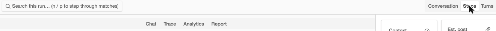
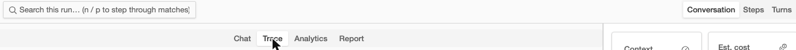
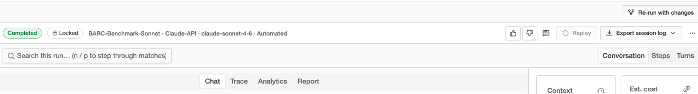
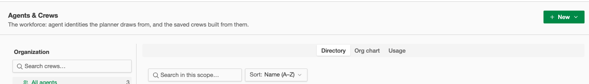
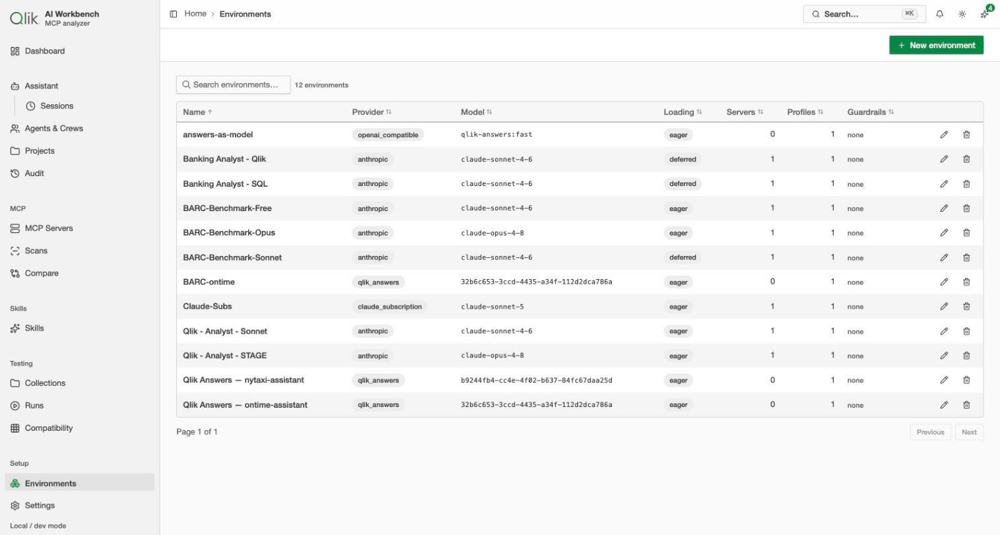
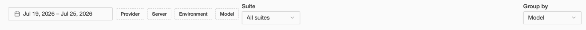
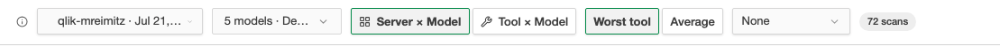
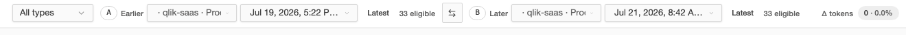
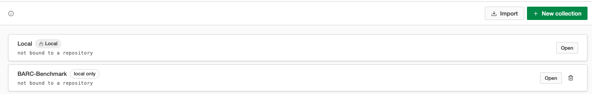

# UI / UX audit — AI Workbench (MCP Token Footprint)

**Date:** 2026-07-25
**Build reviewed:** running instance at `http://127.0.0.1:8080`, `qlik-bright` + `qlik-dark`, viewport 1515×811, `data-density="compact"`
**Method:** browser walk of every nav-reachable route plus the off-nav consoles, geometry measured in the live DOM, then every finding cross-checked against `apps/web/src` before it was written down.
**Scope requested:** (1) navigation & workflow inconsistency, (2) purpose-built page/view design, (3) toolbars — especially unorganized and misaligned ones, (4) general productivity-application practice: tooltips, layout, descriptions.

---

## 0. Verdict up front

The app is in much better shape than a list of 29 findings suggests. The design system is real and it is being used: `StatusBadge` is the only status chip in the codebase, `lib/status` is the only tone authority, tokens hold up in both themes with no raw hex, and **every icon-only button in the app has an accessible name** — I checked 124 of them and found exactly one gap. That is a better baseline than most commercial operator tools.

The problem is not that standards are missing. **The problem is that the standards exist, are written down, are locked, and are only partly applied.** `roadmap/ux-overhaul/toolbar-standard-2026-07-11.md` (D-TB1–D-TB4) is a good standard. `ViewToolbar.tsx` restates it in code. `lib/table.tsx` ships a `shouldPaginate()` helper with a unit test explaining exactly the bug it prevents. Then Environments doesn't use `shouldPaginate()`, Agents & Crews still renders an H1 that D-TB1 retired, and the Dashboard filter row breaks the one rule `TableToolbar`'s own docblock puts in capital letters.

So this audit is mostly not "design this better". It is "finish applying what you already decided", plus three genuine defects that are not cosmetic.

### The three things to fix first

| | Finding | Why it's first |
|---|---|---|
| 1 | **A-1** — Run console's segmented control and tab strip drive one state variable with non-overlapping value sets | Not styling. The control lies to the user in both directions. Reproduced live. |
| 2 | **A-2** — `/testing/runs/new` dead-ends on an error, and the command palette links straight to it | A first-class action in ⌘K lands the user on "Run unavailable". |
| 3 | **C-1** — The Dashboard Testing filter bar (your screenshot) | Three control heights, three top edges, 11px of scatter, in the app's most-seen row. |

### Findings by severity

| Severity | Count | Meaning |
|---|---|---|
| **S1 — defect** | 3 | Wrong behaviour or a dead end, not a matter of taste |
| **S2 — major UX** | 8 | Costs the operator time or confidence on every visit |
| **S3 — consistency** | 13 | Same concept, different rendering — erodes trust in the surface |
| **S4 — polish** | 5 | Worth doing, not worth blocking on |

---

# A. Defects (S1)

## A-1 · Run console: two controls, one state, non-overlapping values — **S1**

`features/testing/RunConsole.tsx` renders two view switchers stacked ~45px apart, and both write `leftView`:

- `ToggleGroup` "Console view" (`:1306-1320`) — `Conversation` | `Steps` | `Turns`
- `TabPanel` strip (`:869-898`) — `Chat` | `Trace` | `Analytics` | `Report`

The tab strip is `value={leftView}` (`:870`). The toggle group is fed through a coercing ternary at `:815`:

```tsx
lens={leftView === "steps" || leftView === "turns" ? leftView : "chat"}
```

**Reproduced live, both directions:**

- Click **Steps** → the toggle group highlights Steps, and the tab strip below shows **no active tab at all**. `steps` and `turns` have `TabPanelContent` panels (`:936`, `:950`) that are not in the `tabs` array, so content renders with nothing indicating where you are.
- Click **Trace** → Trace activates, and the ternary silently snaps the toggle group back to **Conversation**. The segmented control now claims you are looking at the conversation while the Trace panel is displayed.




`chat` is also reachable from both controls, so "Conversation" and "Chat" are two labels for one action, 45px apart.

This is layering damage: `:804` attributes `RunSearchBar` to "Observability WP 3.4", added on top of a `TabPanel` from "findings/09 §2 + WP 6.3". Neither WP owned the union.

**Fix.** Pick one switcher. `Conversation/Steps/Turns` and `Chat/Trace/Analytics/Report` are the same axis — *how do I want to read this run*. Merge into the single `TabPanel` strip: `Chat · Steps · Turns · Trace · Analytics · Report`, delete the `ToggleGroup` and the `:815` ternary, and leave the search field alone in its row. That also removes one of the four chrome rows in A-3.

## A-2 · `/testing/runs/new` dead-ends, and ⌘K links to it — **S1**

`RunConsoleRoute.tsx:241-246` requires `testId` + `scenarioId` in the query string; without them it returns `{missing: …}` and renders (`:312-325`):

> **Run unavailable** — Select a test and environment to start a run. · `[Back to runs]`

An error state that instructs you to do something the screen gives you no way to do. The real launcher is a `Dialog` + `Wizard` opened by the `+ New run` button (`RunsView.tsx:521-526`) — a genuinely good three-step wizard, so this is not a missing feature.

The route is not dead — the wizard itself navigates there *with* params (`RunLauncher.tsx:488`), which is fine. The defect is that there is **no zero-param entry**, and something links to it that way:

```tsx
// features/command-palette/CommandPalette.tsx:144
onSelect={() => runCommand(() => navigate("/testing/runs/new"))}
```

So ⌘K → "New run" reliably lands on an error screen. Bookmarks and the back button do the same.

**Fix.** Make the param-less case open the launcher instead of erroring: in `RunConsoleRoute`, when `isNew` and params are absent, redirect to `/testing/runs` with the launcher open (`?launch=1`), or mount `RunLauncher` in place. Point `CommandPalette.tsx:144` at that. Keep `ErrorState` only for the genuine case — params present but unresolvable.

## A-3 · Run console stacks four chrome rows, one holding a single button — **S1 (density) / S2**

Above the first line of run content, in order:

| # | Row | Source | Height |
|---|---|---|---|
| 1 | **only** `Re-run with changes`, right-aligned | `RunConsoleRoute.tsx:364-379` | ~36px |
| 2 | status · identity · feedback · Replay · Export · ⋯ | `RunBar.tsx:406` | 48px |
| 3 | search + hit stepper + ToggleGroup | `RunConsole.tsx:1256-1321` | ~48px |
| 4 | tab strip (Chat/Trace/Analytics/Report) | `RunConsole.tsx:869` | ~48px |



~170px of chrome before content on a 811px viewport — 21% of vertical space spent on furniture, on the screen where an operator reads long agent transcripts.

Row 1 is the clearest instance of the "unorganized toolbar" you flagged. Its only sibling is `LineageBanner`, which returns `null` unless the run is forked or has forks (`LineageBanner.tsx:27`) — so for **any ordinary run**, that is a full-width bordered row containing one button and nothing else. This is exactly what D-TB2 forbids: *"no floating controls on their own line"*.

**Fix.** Fold `Re-run with changes` into row 2's action cluster next to `Replay`/`Export` — it is the same class of thing. Keep `LineageBanner` as a conditional row (a banner is content, and it already self-collapses). With A-1's merge, the console goes 4 rows → 2.

---

# B. Navigation & workflow (your item 1)

## B-1 · Two page-frame idioms coexist; D-TB1 is half-applied — **S2**

D-TB1 is unambiguous (`toolbar-standard-2026-07-11.md:14`):

> **In-page H1 title + description blocks are removed on ALL views** (owner: "remove everywhere") — top-level lists and detail views alike.

`PageHeader.tsx:17-21` even carries a retirement note telling you not to add it to new views. Three views still use it: **Agents & Crews**, **Projects**, **CompareWorkspace** (`WorkforceView.tsx:155`, `ProjectsView.tsx`, `CompareWorkspace.tsx:137`).

The result is visible the moment you move between sections. Runs, Scans, Collections, Environments, Compatibility, Audit and Sessions have no visible page title at all — just breadcrumb → toolbar → content. Agents & Crews has a 24px title and a description paragraph, pushing its content 80px down.



**Fix.** Finish the migration: convert those three to `ViewToolbar`, move the descriptions into the toolbar's `info` tooltip (which is what `WatchRulesView` and `Audit` already do), delete `PageHeader.tsx`. Deleting it is the point — while it compiles, it will be reached for again.

## B-2 · Environments stacks two toolbars, top one nearly empty — **S2**

`EnvironmentsView.tsx:292-308` passes `ViewToolbar` **only** `actions` — one button on an otherwise blank 48px band. Search and count live in a second `TableToolbar` inside the table (`:360-372`).



Three things make this the sharpest finding in the audit:

1. It violates D-TB2 (*"No second header row"*), and the file's own comment at `:290` claims compliance with D-TB1/D-TB2.
2. `ViewToolbar.tsx:55-61` gives, as its canonical MINIMAL USAGE example, **literally this view done correctly** — `left={<><SearchInput /><FilterBar /></>}` with `actions={<Button>New environment</Button>}`.
3. `roadmap/ux-overhaul/verification-report.md:176` signs off *"D-TB2 (exactly one toolbar row): ✅ one ViewToolbar row per view"*. That sign-off is inaccurate.

Compare **Sessions** and **Audit**, which do it right — search, facets, date range, count badge and the primary action all on one baseline-aligned row. Those two are the reference implementations; Environments should look like them.

**Fix.** Move `SearchInput` + the count `Badge` into `ViewToolbar left`. Drop the in-table `TableToolbar`. Copy `AuditView.tsx:610-653` verbatim as the template.

*(Note: ScansView also uses both, but legitimately — it's master-detail, and `ScansView.tsx:301` documents the rail filter row and the detail `ViewToolbar` as per-region toolbars. Leave it.)*

## B-3 · `TableToolbar`'s contract is stale and contradicts D-TB2 — **S2 (root cause)**

This is why B-2 and C-1 happened. `TableToolbar.tsx:16-29` still documents a pre-D-TB2 world:

> "4. The create/primary action never lives here — **it belongs to the PageHeader**."
> "3. Active filters render as REMOVABLE chips on an optional second row (with 'Clear all')."

But D-TB1 retired `PageHeader`'s title/description slots, and `STATUS.md:227` records that the second-row chips were *"dropped (each control keeps its own clear, per D-TB2)"* — while `TableToolbar` still documents *and implements* them.

A developer following `TableToolbar`'s docblock in good faith puts search in the table and the primary action in the header. That is precisely what Environments does.

**Fix.** Either rewrite the `TableToolbar` docblock to defer to `ViewToolbar`, or — better — delete `TableToolbar` and fold its `results`/`activeFilters` slots into `ViewToolbar`. It has three consumers left. Two contracts for one row is the actual bug; every downstream inconsistency follows from it.

## B-4 · "Home" is a synthetic crumb serving a layout constraint — **S3**

The breadcrumb rule is two-tier and coherent: detail routes get `[<parent list>, <entity>]`; depth-1 list roots get `["Home", <label>]`. The second tier exists for a stated reason (`App.tsx:955`):

> "the shell contract (audit §C) requires the top bar to always carry the breadcrumb — so root these at 'Home' to reach the **≥2-crumb depth** the top bar renders at."

That is a rendering threshold leaking into information architecture. "Home > Audit" tells the operator nothing — there is no "Home" page (`/` redirects to `/dashboard`, which itself has no breadcrumb by design, `:1018`).

I want to explicitly retract a finding I expected to make here: Agents & Crews / Projects / Audit showing "Home" while Sessions shows "Assistant" is **correct**, not a bug. Those three are sidebar *peers* of Assistant, not children (`AppShell.tsx:119-129` — Sessions is the sole `children` entry), and `AppShell.tsx:167-170` shows the team already fixed a bug in the opposite direction. The breadcrumbs mirror the IA exactly. The only real oddity is that the URL namespace `/assistant/audit` implies a parenthood the IA doesn't have.

**Fix (small).** Either let the top bar render a single crumb and drop "Home", or replace it with the section label the sidebar already uses — "Testing > Runs", "MCP > Scans". The second is more useful: it tells the operator which section they're in, which the current crumb doesn't.

## B-5 · Two entry mechanisms for the same task — **S3**

Creating a run is a wizard dialog. Creating a collection is a dialog. Editing an environment is a dialog. But `/testing/runs/new`, `/testing/runs/compare` and `/testing/runs/review` are *routes*. There's no visible rule for which tasks get a URL and which get a modal, and A-2 is the consequence.

**Fix.** State the rule in `.claude/rules/` — suggestion: *anything an operator would bookmark, deep-link or share is a route; anything transient is a dialog.* Then make `/testing/runs/new` obey it (A-2).

## B-6 · 15 nav destinations for ~40 routes — **S3**

`WatchRulesView`, `RubricsView`, `ReviewView`, `CompareWorkspace`, `SuitesView` and both consoles have no nav entry. Some of that is deliberate and commented (`App.tsx:1205-1210` — watch rules and rubrics are reached from Settings → Testing). But Suites is a first-class concept in the data model, reachable only by drilling through a run. Review has a toolbar button on Runs and nothing else.

**Fix.** No new nav items — the 4-item Testing section is a hard-won simplification. Instead surface them where the work is: a "Suites" tab in the Runs feed, and Review/Rubrics as a section in Collections. If an operator can't find a feature without knowing its URL, it isn't shipped.

---

# C. Toolbars, alignment and layout (your item 3)

## C-1 · Dashboard Testing filter bar — three heights, three baselines — **S2**

The row you screenshotted. `features/dashboard/testing/FilterControls.tsx:96-155`. Measured in the live DOM:

| Control | top | height | bottom | visible label |
|---|---|---|---|---|
| Date range | 117 | **30** | 147 | — |
| Provider / Server / Environment / Model | 119 | **26** | 145 | — |
| Suite | **126** | 30 | **156** | "Suite" (above) |
| Group by | **126** | 30 | **156** | "Group by" (above) |

**Three control heights, three top edges, 11px of scatter, 11px of ragged bottom edge.**



The cause is one component. `components/SelectField.tsx:12-27` is a **label-above** stack:

```tsx
<div className="flex flex-col gap-1.5">
  <Label htmlFor={props.id}>{props.label}</Label>
  <Select …><SelectTrigger id={props.id} className="w-full">
```

Drop that into a row with `items-center` and the two stacked fields centre on the *combined* label+control height, so their triggers sit 9px below the chips they sit beside.

This is explicitly banned twice in your own codebase:

- `TableToolbar.tsx:17-18` — *"NO label-above controls inside the bar"*
- `CompatibilityView.tsx:221-222` — *"the field label is the control's accessible name (aria-label) + placeholder — no visible label row (toolbar standard D-TB2)"*

And it has already been diagnosed and fixed once, in a sibling view. `DirectoryTab.tsx:222-226` records replacing `SelectField` *"because the old `SelectField` floated a 'Sort' label ABOVE the control, breaking the row's baseline"* — which is why Agents & Crews shows `Sort: Name (A–Z)` with an inline prefix instead.

Two secondary problems in the same row: it isn't wrapped in `ViewToolbar`, so it gets none of the `h-12`/`bg-card`/gutter framing every other top row has; and `Group by` is right-pinned with `ml-auto` on the element itself rather than a spacer.

**Fix.**

1. Replace both `SelectField`s with bare `Select` + `SelectTrigger aria-label="Suite"` / `aria-label="Group by"`, exactly as `RunsView.tsx:662-676` already does for the *same* "Group by" concept.
2. Wrap the row in `ViewToolbar`, `left` = date + facets, `actions` = Group by. That deletes the `ml-auto`.
3. Add the missing count badge (see C-5).
4. **Then apply the same change to `UsageToolbar.tsx:95,104`** — it is the other remaining `SelectField`-in-a-toolbar and has the identical defect. Fixing one and not the other just moves the inconsistency.

## C-2 · Six filter-chip idioms across the app — **S3**

Same job — "narrow this list" — six different controls:

| Idiom | Where |
|---|---|
| `FacetFilter` dropdown chip | Dashboard, Audit, Sessions, Scans |
| `FilterChip` split button + attached ✕ | `RunFilterBar.tsx:442-469` |
| `Badge` + ghost ✕ + "Clear all" row | `TableToolbar.tsx:80-94` |
| Hand-rolled `Badge` + ✕ | `UsageToolbar.tsx:132-146` |
| `ToggleGroup` segmented | `CompatibilityView.tsx` (×2) |
| `Label` + `Checkbox` inline | `SessionsView.tsx:333` |

An operator who learns filtering on the Runs feed (add-then-configure, ✕ to remove) has to relearn it on the Dashboard (dropdown facets, no chips).

**Fix.** `FacetFilter` for multi-select, bare `Select` for single-select, `ToggleGroup` only for genuinely exclusive view modes. Retire `TableToolbar`'s chip row (B-3) and `UsageToolbar`'s hand-rolled badge. `RunFilterBar`'s add-then-configure idiom is the most powerful and should stay — but only on the Runs feed, where the field count justifies it.

## C-3 · Compatibility toolbar: six bare controls, one meaningless — **S2**



`CompatibilityView.tsx:212-306` spreads six controls as bare siblings into `ViewToolbar left` — a fragment, no wrapper div, no `flex-wrap`, no overflow strategy. Below ~1300px they will collide rather than wrap.

The host-client `Select` (`:296`) is the real problem: its visible text is **"None"**. Nothing on screen says it is about the host client. Its `aria-label="Host client"` means a screen-reader user is better informed than a sighted one — the inverse of the usual failure. The scan select reads `qlik-mreimitz · Jul 21,…` truncated mid-date; the model picker reads `5 models · De…`.

**Fix.** Wrap in `<div className="flex min-w-0 flex-wrap items-center gap-2">`. Give the host-client select `<SelectValue placeholder="Host client" />` and render the empty state as "Host client: none" rather than "None". Widen the scan select or shorten its option label to `<server> · <date>`.

## C-4 · Compare bar: the discriminating token is the one that's truncated — **S2**



The Server A / Server B selects hold `qlik-mreimitz · qlik-saas · Production` — 38 characters — in a **131px** box. Measured `scrollWidth` 129 against a 131px client width, so it is fully clipped. What renders is `· qlik-saas · Pro…`: the leading separator and the type/environment, with **the server name — the only thing that distinguishes A from B on a comparison screen — cut off.**

Neither select carries a `title`, so there is no hover recovery. (The scan selects beside them *do* — `title="33 eligible scans"` — which is the less useful of the two.)

Eleven controls sit in this one row with only `A`/`B` letter chips and `Earlier`/`Later` as orientation.

**Fix.** Put the server name first and let the rest go: `qlik-mreimitz` with type/environment as a secondary `Badge` outside the select. Add `title` with the full value. Widen to `w-56` — there is horizontal room, the row ends at x≈1490.

## C-5 · Count readouts: five renderings of one idea — **S3**

| Rendering | Where |
|---|---|
| `Badge variant="secondary" tabular-nums` | Runs, Audit, Sessions, Issues, Usage |
| `<span className="tabular-nums">` | `ScansView.tsx:331` |
| Plain string, no element | `EnvironmentsView.tsx:366` |
| `Text variant="meta"` "Run n of N" | `ReviewView.tsx` |
| **Absent** | Dashboard Testing tab |

The Badge form is the majority and the most legible. Standardise on it; add it to the Dashboard.

## C-6 · Row containers never converge — **S4**

Across ~15 toolbar rows: `gap-1.5` / `gap-2` / `gap-3`; `flex-wrap` present or absent; `overflow-x-auto` + hidden scrollbar in only 2; and four control-width strategies (`w-40 shrink-0`, `w-44 min-w-0`, `w-56 shrink-0`, `containerClassName="w-64"`, plus intrinsic).

**Fix.** Have `ViewToolbar` own the `left` container — render `left` inside `flex min-w-0 flex-wrap items-center gap-2` itself, so consumers pass controls, not layout. That makes the correct behaviour the default and deletes ~15 wrapper divs.

## C-7 · Collections: an empty toolbar and ragged action alignment — **S3**



Two problems in one screen. The toolbar carries a lone ⓘ and two right-aligned buttons — 48px for a tooltip. And in the list, `Local` has no delete affordance (correct — it's undeletable) so its `Open` button sits at x≈1447, while `BARC-Benchmark`'s sits at x≈1413. The right edge is ragged in a two-row list.

Also: `not bound to a repository` renders in the **monospace** face. Code font for prose.

**Fix.** Reserve the action column width whether or not the delete button renders (render a disabled/invisible placeholder, or make the action cluster a fixed-width grid cell). Set the "not bound" text in the body face. Move the ⓘ content into the empty-state card and drop the bar, or put a search field in it once collections exceed a handful.

## C-8 · Single-page pagination — **S3**

`lib/table.tsx:257-262` ships `shouldPaginate()` specifically to stop `@brand/data` rendering "Page 1 of 1" with two disabled buttons. I confirmed the underlying behaviour in the vendored `brand-data-1.9.0` bundle: `renderPagination()` is unconditional once `enablePagination` is set.

**2 of 8 call sites use it.**

| Call site | Guarded |
|---|---|
| `dashboard/ScansTab.tsx:518` | ✅ |
| `servers/ServersView.tsx:945` | ✅ |
| `testing/EnvironmentsView.tsx:356` | ❌ |
| `testing/collections/CollectionTests.tsx:404` | ❌ |
| `skills/SkillVersions.tsx:254` | ❌ |
| `skills/ScaffoldFromServerWizard.tsx:565` | ❌ |
| `servers/ServersView.tsx:902` (Resources) | ❌ |
| `servers/ServersView.tsx:927` (Prompts) | ❌ |

`ServersView` imports the helper at `:65`, uses it at `:945`, and omits it at `:902` and `:927` — same file.

**Fix.** Mechanical: `enablePagination={shouldPaginate(rows.length, PAGE_SIZE)}` at all six. Then add a lint rule or a test that fails on a bare `enablePagination`, because this will drift again.

## C-9 · Centred tab strips in a left-aligned app — **S4**

`ScrollableTabsList fullWidth` centres the tabs on Dashboard, Servers, Scans, Compare and the consoles. Everything else on the page — breadcrumb, toolbar, table headers, card titles — is left-aligned to the gutter. The centred strip floats free of that spine, and on Dashboard it is the *only* thing in a 48px band.

Centred tabs read as consumer-app navigation. Dense operator tools left-align so the eye has one vertical edge to track.

**Fix.** Left-align the strip to `GUTTER_X`. One prop on `TabPanel`.

## C-10 · Compatibility: one data row in an 800px viewport — **S4**

The Server × Model heatmap renders a single subject row, then ~470px of empty page. The legend (Green/Amber/Red) floats top-right, detached from the grid it explains.

**Fix.** With one subject, lead with Tool × Model instead — that's the view with content. Move the legend adjacent to the grid.

---

# D. Purpose-built views and workflow design (your item 2)

## D-1 · Scans: a 390px rail beside 800px of nothing — **S2**

The scan list is squeezed into a narrow master rail where the `Δ vs previous` header wraps onto two lines and the timestamp collapses under the server name, while the detail pane — 55% of the window — holds an empty-state card.

Scans is a *list-first* surface. You arrive to scan the history, not to look at a pre-selected scan. Servers and Skills are correctly master-detail (you pick a known entity). Scans isn't.

**Fix.** Either make the list full-width until a scan is picked, then transition to master-detail, or widen the rail and drop the `Δ vs previous` column into a sparkline. As it stands, the most valuable column is the least readable.

## D-2 · Dashboard KPI row leaves an orphan — **S3**

Five KPI cards in a four-column grid: `Runs · Error rate · Active p95 · $ Exact`, then `Waiting for you` alone on row two at quarter width.

**Fix.** Five cards want a five-column grid at this width, or promote `Waiting for you` — it's the only actionable one — into the "Needs attention" panel where it belongs.

## D-3 · Same status, two renderings, two screens — **S3**

`ScansTab.tsx:214-228` renders a successful scan as muted `<Text>Completed</Text>` and everything else as `<StatusBadge>`. `ScansView.tsx:190` renders the *same* status as `<StatusBadge>` unconditionally — a green "Completed" chip.

I want to be fair here: this is **not** drift. The inline comment names it decision D4 (*"a success renders as quiet muted text… so the column reads as 'what needs me', not an all-green wall of decoration"*), and that reasoning is good. But it collides with `StatusBadge.tsx:12-16`, which claims *"**Every** state chip … renders through here so one concept has one rendering."* Within `ScansTab.tsx` alone, a success is muted text in the activity table (`:220`) and a chip in the attention queue above it (`:353`).

**Fix.** Keep D4's intent, make it a variant rather than an exception: give `StatusBadge` a `quiet` prop for success-in-a-list. One component, one concept, two densities.

## D-4 · Dashboard tabs pad and filter differently from each other — **S3**

Three tabs of one page. The Testing tab crams date + 4 facets + 2 selects onto one row with no padding wrapper; the Issues tab splits chips and search across **two** rows with `p-4` (`IssuesFleetTab.tsx:150-159`). `IssueFilters.tsx:33-37` says it *"mirrors the Testing dashboard's FilterControls recipe"* — it doesn't, and it's the better of the two for being all label-in-control.

**Fix.** One filter row shape for all three tabs. Take Issues' control vocabulary and Testing's single-row layout.

## D-5 · Settings hosts a pointer instead of a setting — **S3**

The General pane reads: *"Theme (System · Bright · Dark) is switched from the top bar."* Settings is where an operator looks for settings. A sentence telling them to look elsewhere is a workflow dead end — and the top-bar control is an icon-only cycle button with no visible state.

**Fix.** Put the theme control in Settings *as well*. Keep the top-bar shortcut. Two entry points to one preference is fine; a signpost is not.

## D-6 · "Metrics · Soon" and a disabled Export — **S4**

`CompareBar.tsx:426-441` renders a "Metrics" mode badged `Soon`, deliberately left clickable so the empty state is a confirmation rather than a surprise (documented as D2 at `:400-403`), with `aria-label` carrying "(coming soon)".

That is a considered pattern and I'm not going to call it an accessibility defect. The product question stands: shipping an advertised-but-empty mode in an operator tool spends credibility. Either finish it or hide it behind a flag.

The disabled `Export` beside it **does** explain itself — `title="Add a second run to export a comparison"` (`:372-384`). But see D-7: it's the weakest of the three mechanisms and invisible to assistive tech.

## D-7 · Three hover-hint mechanisms for icon-only buttons — **S2**

The a11y baseline here is genuinely good — of ~124 icon-only buttons, exactly **one** lacks an accessible name (`hub/memory/EffectiveMemoryStack.tsx:151`). The problem is the *sighted mouse user*, who gets three different behaviours:

| Mechanism | Count | Behaviour |
|---|---|---|
| Radix `Tooltip` | ~14 (11%) | Styled, fast, themed |
| Bare `title` | ~20 (16%) | ~1.5s OS delay, unstyled, not in `aria-describedby` |
| `aria-label`/`sr-only` only | ~89 (72%) | **Nothing on hover at all** |

Three of these appear within one component's toolbar. `SkillInspector.tsx:578` uses `title` for the gear; `:611-648` uses Radix Tooltips for Pull/Push — under a comment at `:606` asserting the convention (*"tooltips carry the labels"*). `SkillRail.tsx:87`'s "Add skill" has neither.

For a business tool this is the highest-leverage item in section D. 72% of icon buttons are unlabelled to the eye, and this app's icons are not conventional — a pencil is obvious, `GitFork` / `ScanLine` / `Grid3x3` are not.

**Unlike C-1 and B-2, there is no written rule to point at.** Grep for "icon-only" across `.claude/` and `roadmap/` returns one to-do note, not a standard. This is a gap to close, not drift to correct.

**Fix.**
1. Write it down as D-TB5 in `.claude/rules/`: *every icon-only control carries a Radix `Tooltip`; `title` is never used for this; `aria-label` is required and must match the tooltip text.*
2. Ship an `IconButton` wrapper that takes `label` and renders both the tooltip and the `aria-label` from one prop — the only reliable way to keep 124 call sites honest.
3. Convert the ~20 `title` sites, starting with the form kit (`ListEditor` `:59`, `KeyValueEditor` `:119`, `TagInput` `:76`, `SliderNumber` `:94`), since those are reused everywhere.
4. Include disabled-reason text (D-6) and wire it to `aria-describedby` so it reaches screen readers.

## D-8 · Two error/empty-state treatments — **S3**

`ErrorState` renders a full-width pink band with a left accent bar; empty states render a centred dashed-border card. On a bad collection id you get the pink band; on Compare with nothing selected you get the dashed card. Both are "there's nothing here yet", styled as different severities.

**Fix.** Reserve the pink `ErrorState` for genuine failures (fetch failed, connection refused). "Nothing selected / not found" is an empty state — dashed card, with the action that resolves it.

## D-9 · Two controls for "Show archived" — **S3**

Four surfaces implement it. Three use a `Checkbox`; `hub/projects/ProjectLibraryPanel.tsx:299` (rendered by `ProjectsView`) uses a `Switch`. It also inverts label order — `<span>` before the control with `justify-between`, where the checkbox sites put the control first.

Semantically the checkbox is right: this filters a list, it doesn't toggle a system state.

**Fix.** Make Projects a `Checkbox`, matching Sessions / RoleLibraryPanel / ScopedMemoryList. Note `ProjectLibraryPanel.test.tsx:345` asserts the `switch` role, so the test moves with it.

## D-10 · Long descriptions truncate with no recovery — **S4**

Agent cards clamp descriptions at ~2 lines with an ellipsis and no tooltip or expand. Same in the Skills frontmatter panel (`Description` ends `…Q…`). The truncated text is often the part that distinguishes two similar agents.

**Fix.** `title` on the clamped element at minimum; better, expand on click.

---

# E. What's working — don't regress it

Worth stating plainly, because a findings list distorts the picture:

- **`StatusBadge` + `lib/status`** is a genuine single source of truth. Nobody hand-rolls chip classes anywhere in the codebase.
- **Both themes hold up.** I walked the app in `qlik-dark` and found no contrast failure, no unthemed surface, no raw colour.
- **Accessible naming is near-perfect** — 123 of 124 icon-only buttons named. That is rare.
- **The run launcher wizard** is the best-designed flow in the app: three steps, honest descriptions, state carried in the step rail, cost cap surfaced before you commit.
- **Sessions and Audit toolbars** are exactly right — one row, all label-in-control, count badge, primary action right-pinned. They are the template for everything in section C.
- **`ViewToolbar`, `PageShell`, `lib/table`, `TabPanel`** are well-designed primitives with real docblocks. Most findings here are about reach, not quality.
- **The Assistant meta rail** (Progress / Outputs / Context) is a strong pattern — live mission state without leaving the conversation.

---

# F. Sequenced fix plan

Ordered by value ÷ effort. Each block is independently shippable behind `pnpm typecheck && pnpm test && pnpm build && pnpm lint`.

### WP1 — Defects (½ day)
- A-1 merge the run-console switchers, delete the `:815` ternary
- A-2 param-less `/testing/runs/new` opens the launcher; fix `CommandPalette.tsx:144`
- A-3 fold `Re-run with changes` into the RunBar cluster

### WP2 — Settle the toolbar contract (½ day) — *do before WP3*
- B-3 delete `TableToolbar` (3 consumers) or make its docblock defer to `ViewToolbar`
- C-6 move the `left` flex container into `ViewToolbar` itself
- B-1 migrate the last 3 `PageHeader` views, then delete `PageHeader.tsx`

### WP3 — Apply it (1 day)
- C-1 Dashboard filter bar → `ViewToolbar`, `SelectField` → `Select` + `aria-label`
- C-1(4) same change at `UsageToolbar.tsx:95,104`
- B-2 Environments → one row, modelled on `AuditView.tsx:610`
- C-3 Compatibility wrapper + host-client placeholder
- C-4 Compare bar: name-first, `title`, wider
- C-5 count badges everywhere, including the Dashboard
- C-8 six `shouldPaginate()` call sites + a lint rule

### WP4 — Icon affordances (1 day)
- D-7 write D-TB5, ship `IconButton`, convert the ~20 `title` sites, wire disabled reasons

### WP5 — View-level design (1–2 days)
- D-1 Scans list-first
- D-3 `StatusBadge quiet` variant
- D-4 one Dashboard filter shape
- C-7 Collections action-column reservation; C-9 left-align tab strips; D-2 KPI grid
- D-5 theme control in Settings; D-8 error vs empty; D-9 archived checkbox

### WP6 — Guardrails (½ day)
So this doesn't drift a third time:
- a test that fails on bare `enablePagination`
- a test that fails on `SelectField` imported into a toolbar module
- an `enforce-brand-ui`-style hook rejecting `title=` on a `<Button>` with no text child
- correct `roadmap/ux-overhaul/verification-report.md:176`, which currently signs off a rule two views break

---

## Appendix — coverage

**Walked:** `/dashboard` (Scans · Testing · Issues), `/servers` + detail, `/scans`, `/compare/scans`, `/skills` + inspector, `/testing/collections`, `/testing/runs` + console + `/new` + `/compare`, `/testing/compatibility`, `/testing/environments`, `/assistant`, `/assistant/sessions`, `/assistant/agents`, `/assistant/projects`, `/assistant/audit`, `/settings`, run launcher wizard. Both themes.

**Not covered — needs a real workload or credentials:** suite-run console with a live suite, SkillFlow Design/Trace canvas, Qlik Answers surfaces, watch rules and review rubrics with data, OAuth flows, responsive behaviour below 1200px, full keyboard-only traversal, screen-reader pass.

**Retracted during verification** — stated here so the record is honest:
- "Breadcrumbs are inconsistent because Agents/Projects/Audit are children of Assistant" — **wrong**, they are sidebar peers; the code anticipates this objection at `AppShell.tsx:167-170`. Reduced to B-4.
- "Compare's disabled Export has no explanation" — **wrong**, `title` at `CompareBar.tsx:372-384`. Folded into D-7.
- "'Latest server footprint' renders status a third way" — **wrong**, it has no status column.
