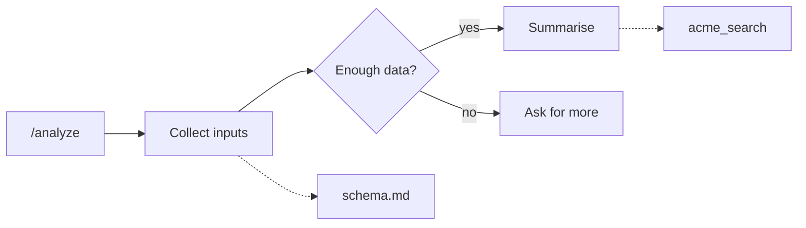

# WP 7.8 design — edge grammar + entry-point flows

> **APPROVED BY THE OWNER 2026-08-22.** All six recommended decisions (1–6) were accepted as
> written. **Decision 7 — the genuine call — is settled: a trace recorded before the change
> DEGRADES with a visible notice** rather than being migrated or hidden; they are records of past
> runs, not live state. One consequence rides with decision 5: **WP 7.8's build may take one
> migration** for app-side box positions, and must ship the Auto-arrange reset button that decision
> names. A separate finding in this doc — that the projector resolves branch targets in NO real
> case, so every fork currently draws as a straight line — was NOT folded into 7.8: the owner chose
> to **investigate how branches are actually written in the registered skills first**, and decide
> then whether it is a small fix or its own work package.

**This is a proposal, not a build.** No application code changed. WP 7.8 is marked *"short design
doc → owner approval BEFORE build"*; this is that document. The decisions are listed at the end.

**Where the brief came from.** The wording I worked to is the WP 7.8 line in
[`STATUS.md`](./STATUS.md) and the D-UX19 entry in its decision log. The audit document those
findings (SI11, SI10) were written into was never committed to this repository, so I could not read
the owner's original phrasing — only its summary. Everything else below is read from the shipped
code.

---

## 1. What the picture on the canvas means today

A skill is a Markdown document. The app reads it and draws it as a diagram of boxes and arrows so
you can see the shape of the instructions you are shipping to a model.

The boxes are typed — a step, a decision point, a bundled file, a tool call, a trigger. **The arrows
are not.** In the stored model an arrow is only "this box, then that box." Nine genuinely different
relationships are drawn today as the same anonymous line: a keyword starting the skill, one step
following another, a step containing a sub-step, a decision branching, a step opening a file, a step
calling a tool, a step pointing at another `/command`, and two kinds of check attached to a step.

The app already *knows* these are different — the in-app teaching layer
(`apps/web/src/features/skills/design/code-intel/explainers.ts`) defines and explains three edge
kinds by name ("Sequence edge", "Branch edge", "Reference edge"), each linked to a section of the
authoring guide. The vocabulary exists in the help text and nowhere in the data. So the canvas
cannot draw a branch differently from a file reference, and nothing downstream can answer the one
question that matters: **when this skill fires, what does the model actually end up reading?**

That question is the whole point of this workbench. Answering it is what WP 7.8 is for.

---

## 2. Decision 1 — the legal edge set

I propose the arrow gains a **kind**, and exactly five kinds exist. Each says something different
about what happens at read time.

| Kind | Drawn from → to | What it means when the skill runs |
| --- | --- | --- |
| **Triggers** | a trigger (keyword or `/command`) → what it starts | This input is what causes the model to read the target at all. |
| **Then** | a step → the next step at the same level | Having finished the source, the model reads the target next. Always read. |
| **Contains** | a step → a sub-step | The target is part of the source. Reading the parent means reading this. Always read. |
| **Branch** | a decision point → one of several steps | The model reads **exactly one** of these, whichever condition holds. Carries the condition text. Conditionally read. |
| **Uses** | a step → a file, a tool, a check, or a loop guard | While working through the source, the model may open this file or call this tool. Conditionally read, and it costs tokens only if it is opened. |

**Everything not in that table is illegal.** A file cannot point at anything. A tool cannot point at
anything. A trigger cannot be the target of an arrow. Two triggers cannot be connected. A step
cannot branch unless it is a decision point.

Two notes on the shape:

- **"Then" and "Contains" are deliberately separate**, even though both mean "always read." They
  differ in what an author is allowed to do next: you can reorder a *Then* chain freely, but a
  *Contains* child moves with its parent. Collapsing them into one kind would make the canvas unable
  to express nesting, which is how every real skill is written.
- **"Uses" deliberately merges four things** the projector currently distinguishes — bundled file,
  tool call, validation check, loop guard. They differ in what the *box* is, not in what the arrow
  means. Splitting the arrow as well would give the author a choice with no consequence.

### The one thing the current model gets wrong

A decision point's branches do not go anywhere real today. The projector
(`apps/api/src/skillflow/projector.ts`) reads the condition words out of the prose, then points
**every branch at the same next section** and records a warning admitting it:
*"branch targets are not resolvable to sections; routed to the next section with condition labels."*
So the diagram shows a fork that is not a fork. Introducing a `Branch` kind without fixing that
would formalise the wrong picture — see the recommendation in §7.

---

## 3. Decision 2 — what an entry-point flow shows

A skill can be entered two ways: a **keyword** in the user's message, which loads the whole skill, or
a **`/command`**, which points at one specific part of it. Today the canvas groups boxes into lanes
by which command they were written under, and the flow picker filters by lane membership. That is a
filter on *where text sits in the file*, not on *what gets read*.

I propose replacing it with **reachability**: pick one entry point, follow the arrows forward, and
what you reach is what that entry point puts in front of the model. Each thing reached is then
labelled:

- **Always read** — every arrow on the path to it is a *Triggers*, *Then* or *Contains*.
- **Maybe read** — at least one *Branch* or *Uses* arrow lies on the path.

Solid arrows are always read. Dotted ones are maybes. The panel beside the canvas then reads:
*"/analyze — always reads 4 sections, 1,240 tokens. May additionally read 1 file and call 1 tool,
up to 3,900 tokens."* **That number is the deliverable.** It is what turns the diagram from a picture
into a measurement, and it is why this work package is worth its size.

Three consequences the owner should agree to before it is built:

1. **A step can appear in more than one flow.** If both `/analyze` and `/report` reach "Collect
   inputs", it belongs to both. Today it belongs to exactly one lane. This is the correct answer and
   it is a visible change.
2. **Files and tools stop being drawn once per mention.** Today the projector creates a separate box
   each time a file is referenced, so one file cited by four steps appears four times. I propose one
   box per file or tool with four *Uses* arrows into it — otherwise "how many files does this
   command read" cannot be counted, and the canvas is cluttered for no gain.
3. **A keyword's flow is the whole skill.** Keywords trigger the entire document; there is no
   per-keyword subset to compute. Any attempt to show one would be a fiction. Stated here so nobody
   later builds it.

---

## 4. Decision 3 — what a refused connection says

Today there is exactly one connection you are allowed to draw — a step to a bundled file. Every
other drag is allowed to complete and is then met with a red toast reading *"Couldn't create that
connection — A connection runs from a section to an asset file"*
(`apps/web/src/features/skills/design/UnifiedEditor.tsx`). It names one legal move and does not say
which part of what you just did was wrong.

I propose three behaviours, in this order:

1. **Prevent the impossible silently.** While you are dragging, only targets that could legally
   receive the arrow highlight. An arrow into a file, or out of a tool, simply does not snap. No
   error, because nothing went wrong — you were shown the rule instead of told it afterwards.
2. **When the intent is obvious, offer the legal move instead of refusing.** Dropping a tool onto
   another tool almost always means "have this step call it too." The message becomes an offer with
   a button: *"A tool can't be called by another tool. Call it from **Summarise** instead?"* — one
   click applies it. This is the case that happens most and it should not end in a dead stop.
3. **When it is genuinely wrong, explain in the vocabulary the app already teaches.** The message
   names the kind of arrow that was attempted and links the guide section for it. The registry of
   explanations, one per edge kind with a verified link into the authoring guide, is already built
   and already covered by a test — this reuses it rather than writing new copy.

The rule I would hold the build to: **no message that only says an action failed.** Every one either
offers the correct move or names the rule that was broken.

---

## 5. Decision 4 — where box positions live

You can already drag a box. That shipped. What does not exist is any memory of it: the positions
live in browser state keyed to the exact current layout, and they are discarded when you add a
section, switch version, or reload the page. So the arrangement you made is gone by the time you come
back to it.

Two places it could be remembered:

**(a) In the skill itself** — written into `SKILL.md` as hidden comments, travelling with the skill
wherever it is exported. Portable. But:

- **It costs tokens on every single use of the skill.** The body of `SKILL.md` is exactly what the
  model reads, and this app meters it as the skill's L2 footprint. Hidden comments are invisible to
  a reader and fully visible to the tokenizer. A tool whose purpose is measuring context cost should
  not inflate that cost to store cosmetics.
- **Every version is an immutable snapshot.** Moving a box would either mark the draft dirty — so
  nudging a box asks you to cut a new version of your skill — or be silently thrown away.
- **It appears in every diff.** The version-comparison view would show layout churn interleaved with
  real changes to your instructions.

**(b) Beside the skill, in the app's own database** — a small table mapping a box to a position, kept
per skill rather than per version so the arrangement survives saving. The skill file stays clean and
exports clean. Costs one database migration and one small table. Its weakness is that box identity is
derived from the document, so heavily restructuring a skill will orphan some positions.

**I recommend (b)**, with two conditions: an orphaned position falls back to automatic layout for
that one box (never a broken canvas), and there is always a visible **Auto-arrange** button that
clears the saved positions — so a user who has made a mess has a way back.

The portability argument for (a) is weaker than it sounds. A skill authored anywhere else has no
positions to import, and a skill exported to a real agent runtime has no use for them.

---

## 6. Decision 5 — what changes, and what breaks

**Already built — not part of this proposal.** Dragging boxes; the lane model and flow picker;
left-to-right geometry with side-mounted arrows; step-to-file connect and disconnect; dropping a tool
onto a step; the Problems panel; the explanation registry with its guide links. WP 7.8 builds on all
of it.

**Holds unchanged.** The one-draft, staged-edit architecture: nothing on the canvas mutates a skill
directly — every gesture stages a typed edit reviewed at save. New connections follow the same path.

**Changes.**

| Where | What |
| --- | --- |
| `packages/shared/src/types.ts` + `schemas.ts` + `constants.ts` | The arrow gains an optional `kind`. Additive — a graph produced before this still loads. |
| `apps/api/src/skillflow/projector.ts` | Stamps a kind at each of the nine places it currently creates an anonymous arrow; merges duplicate file and tool boxes; resolves decision-point branches to real targets. **The bulk of the work is here.** |
| `apps/web/src/features/skills/design/UnifiedEditor.tsx` | The connect handler grows from one legal pair to the table in §2, plus live prevention while dragging. |
| `apps/web/src/features/skills/design/SkillGraphCanvas.tsx` | Flow view filters by reachability instead of lane membership; arrows are drawn differently per kind. |
| `apps/web/src/features/skills/design/graph-layout.ts` | Lanes are grouped by lane membership today; once a step can belong to two flows, the "one entry point" view lays out one flow at a time and the "All" view keeps today's stacking. |
| `apps/web/src/features/skills/design/use-edit-ops.ts` | The instant on-canvas preview must show the new connection kinds before save. |

**Breaks.**

- Fixing decision-point branches and merging duplicate file boxes **changes the diagram for skills
  that already exist**. The projector's stored test fixtures and the layout tests move with it. This
  is intended, but it means "the graph looks different than yesterday" is an expected outcome, not a
  regression.
- **The riskiest coupling: the projector is not only the canvas's source.** The same graph drives
  trace replay (matching a real test run onto the diagram), the quality findings, and the
  cross-skill trigger-collision report. Merging duplicate boxes changes which box a recorded
  "the agent read this file" event lands on. **A trace verdict recorded before the change may point
  at a box id that no longer exists.** I read the alignment code but did not run a trace against it;
  this needs a deliberate check during the build, and possibly a decision to let old traces degrade
  rather than migrate them.

---

## 7. Cost, risk, and what I would not do

**Size.** The work package is already marked XL and I agree. It is realistically four pieces: the
shared contract and projector (the majority, and the only genuinely risky part), the reachability
view and per-kind drawing, the connection grammar and its guidance, and position persistence. The
last two are small and independent; the first two are not separable from each other.

**The three risks, in order:** the projector feeds five consumers, not one; box identity is what both
saved positions and trace replay depend on; and making flows overlap is a real behaviour change that
needs to be wanted rather than tolerated.

**Two things I recommend leaving out of this work package:**

1. **Do not let an author draw a branch by hand yet.** Include *Branch* in the grammar so branches
   can be read, drawn and counted — but the projector currently cannot resolve a branch to a real
   target and says so in a warning. Fix that first; drawing a fourth branch onto a decision point
   whose existing three do not go anywhere would make the picture less true, not more.
2. **Do not compute per-keyword reading lists.** A keyword loads the whole skill. Any finer answer
   would be invented.

**One thing I could not determine from the code:** whether real skills in the registry write their
branch conditions in a form the projector could resolve at all. The current code gives up and warns
in every case. If the answer turns out to be "no, authors write branches as prose", then decision
points need an authoring affordance before the branch grammar means anything — which would be its
own work package, not a line item in this one.

---

## What I am asking you to approve

1. **The edge grammar is five kinds — Triggers · Then · Contains · Branch · Uses — and everything
   outside the table in §2 is illegal.** ✅ *Recommended.* The alternative considered was four
   kinds (merging *Then* into *Contains*); I recommend against it, because it makes nesting
   inexpressible.
2. **An entry-point flow is derived by following arrows forward from the entry point, and every
   item reached is labelled "always read" or "maybe read", with a token figure for each.** ✅
   *Recommended.* This replaces today's lane-membership filter and accepts that a step can appear in
   two flows.
3. **Files and tools are drawn once, with many arrows into them, instead of once per mention.** ✅
   *Recommended* — without it, "how much does this command read" cannot be counted.
4. **A refused connection never just reports failure**: impossible targets are prevented silently
   during the drag, near-misses are offered the correct move as a one-click action, and genuine
   errors name the rule and link the guide. ✅ *Recommended.*
5. **Box positions are stored app-side, per skill, not written into the skill file.** ✅
   *Recommended*, because comments in `SKILL.md` cost real tokens on every use of the skill — the
   exact cost this app exists to measure. Requires accepting one database migration, plus an
   Auto-arrange reset button.
6. **Drawing a branch by hand is deferred**, and the projector's unresolved branch targets are fixed
   first. ✅ *Recommended* — the alternative is a diagram that shows forks that do not fork.
7. **Accept that the diagram will change for skills that already exist** (duplicate file boxes merge,
   branches move), and that a trace recorded before the change may no longer line up with the
   diagram. ⚠️ *Needs an explicit call:* migrate old traces, or let them degrade with a visible
   notice. I would let them degrade — they are records of past runs, not live state.
