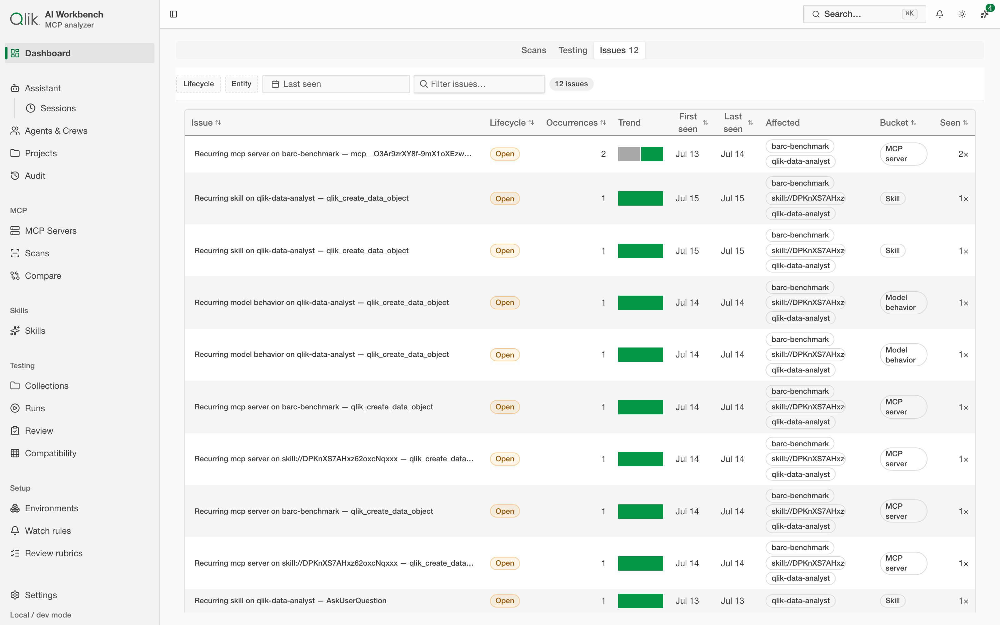

# 2. Getting started

This page gets the app running and gives you a tour of the interface so the rest of the guide
feels familiar.

## Running the app

AI Workbench runs **locally on your own machine**. The simplest way to start it is with Docker.

### Option A — Docker (recommended)

From the project folder, run:

```bash
docker compose up --build
```

When it finishes starting, open the app in your browser at:

```
http://localhost:8081
```

That's it — everything (the interface and the engine behind it) runs from that one address.

### Option B — Local development

If you're running from source instead:

```bash
pnpm install
pnpm dev
```

This starts the engine on `http://127.0.0.1:8080` and the interface on `http://127.0.0.1:5173`.
Open the second address in your browser.

> Your data — connected servers, scans, and saved credentials — lives in a local database file.
> As long as you keep that file, your work persists between restarts. See
> [Settings](../DC-14-settings-and-features/13-settings.md) for where it lives and how to maintain it.

## A tour of the interface

The app is a single window with a **navigation sidebar** on the left, a **top bar** across the
top, and the main content in the middle. Here's what you'll find.


### The sidebar (left)

The sidebar is grouped by area. **Dashboard** sits on its own at the top; below it the groups run
Assistant → MCP → Skills → Testing → Setup.

- **Dashboard** — your at-a-glance home: token totals across every server, what needs attention,
  and recent activity. It has three tabs — **Scans**, **Testing**, and **Issues** — covered under
  [The Dashboard](#the-dashboard) below.

**Assistant** — the full-page AI workspace and its supporting views:

- **Assistant** — a general-purpose, multi-model assistant with chat, research, and multi-agent
  **mission** modes (see [Assistant](../DC-13-assistant-hub/16-assistant-hub.md)). This is different from the **App
  assistant** dock in the top bar, which operates the page you're on.
- **Sessions** — a list of your past assistant sessions.
- **Agents & Crews** — the directory of saved agents and the crews they belong to.
- **Projects** — pinned context and instructions a session can inherit.
- **Audit** — a timeline of what the assistant did.

**MCP** — the analyzer core, where most footprint work happens:

- **MCP Servers** — add, configure, test, and scan your servers.
- **Scans** — browse past scans and read their token footprint.
- **Compare** — put two scans side by side, over time or across servers.

**Skills**

- **Skills** — register and inspect Agent Skills (see [Skills](../DC-07-skills/08-skills.md)).

**Testing** — drive servers through real sessions and review the results:

- **Collections** — where your tests live.
- **Runs** — every session you've run, with its cost, grade, and status (see
  [Testing console](../DC-08-testing-console/09-testing.md)).
- **Review** — a queue for judging runs against a rubric.
- **Compatibility** — whether a server's tools fit within each model's context limit.

**Setup** — configuration for the Testing surfaces:

- **Environments** — the reusable configurations your runs use.
- **Watch rules** — alerts that fire when a run matches conditions you set.
- **Review rubrics** — the criteria the Review queue grades against.

### The top bar

- **Search** — opens a command palette so you can jump to any screen or action by typing. This
  is the fastest way to get around.
- **Theme** — switch between **Light**, **Dark**, and **System**
  (follow your operating system's setting).
- **App assistant** (⌘J) — opens a side dock with a built-in AI helper that understands the page
  you're on and can act on your data with your approval (see [App assistant](../DC-12-app-assistant/12-assistant.md)).
- **Settings** — provider credentials, appearance, and storage maintenance
  (see [Settings](../DC-14-settings-and-features/13-settings.md)).

## The Dashboard

The Dashboard is your home screen, and it has three tabs:

- **Scans** — the analyzer overview: total startup tokens across every server, a "Needs attention"
  list (servers that failed or were never scanned), "Biggest movers" since your last visit, KPI
  tiles (servers, resources, prompts, largest single tool, tools scanned), and a **Latest server
  footprint** table you can click straight into.
- **Testing** — a rollup of your recent runs and suites: how many you've run, what they cost, and
  the current failure rate, so you can see the health of your testing at a glance.
- **Issues** — the fleet-wide issue queue. When a run is graded and something goes wrong, a tracked
  **issue** is filed against the skill or server involved. This tab is where those collect, so you
  can triage what's breaking across everything you run.



## Your first five minutes

The quickest way to see what the app does:

1. Go to **MCP Servers** and [add a server](../DC-02-mcp-servers/03-connect-a-server.md).
2. **Test** the connection to confirm it works.
3. **Scan** it, then [read the footprint](../DC-03-scans-and-footprint/04-scan-and-read-footprint.md) — the total plus
   every tool ranked by cost.
4. Open a tool and **[run it](../DC-05-tool-playground/06-run-a-tool.md)** to see what a real call costs.
5. **[Export a report](../DC-06-reports/07-reports.md)** to save the results.

The next page walks through step 1 in detail.

---

Next: [Connect a server →](../DC-02-mcp-servers/03-connect-a-server.md)
