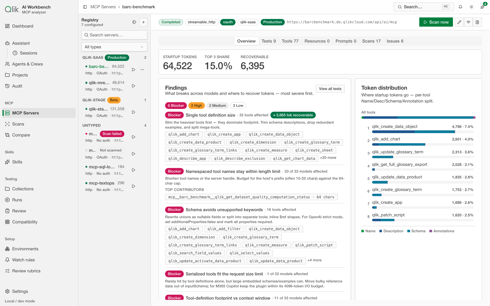

# 3. Connect a server

Before you can measure anything, you need to tell the app about an MCP server. This page covers
adding a server, the two connection types, authentication, and testing that it works.

Go to **MCP Servers** in the sidebar, then choose **Add MCP server**. A wizard opens.

## Step 1 — Choose how to connect (Transport)

At the top of the wizard you pick a **Transport**:

- **Local command** — the server runs as a program on your machine. Choose this for stdio
  servers you start with a command.
- **Server URL** — the server runs as a web service you reach over HTTP.

The fields below the wizard change depending on which you pick.

## Step 2 — Name and (optional) type

- **Name** — a label for the server so you can recognize it later (e.g. "My MCP server").
- **Type** — an optional category. You can leave it as **No type / Untyped**. Types are handy
  later when you want to filter or [compare](../DC-04-comparison/05-compare.md) servers of the same kind.

## Step 3a — If you chose "Local command" (stdio)

Fill in how to launch the server:

- **Command** — the executable to run.
- **Arguments** — the command-line arguments, added one at a time with **Add argument**
  (for example, a flag like `-y` followed by a package name).
- **Environment variables** — any variables the server needs, added with **Add variable**.
  Values you enter here are treated as secrets: they're **encrypted before being saved** and
  are never shown back to you afterward.

## Step 3b — If you chose "Server URL" (streamable HTTP)

- **Server URL** — the address of the MCP server's endpoint.

When you provide a URL, the app **probes it without any credentials first** to see how it
responds. Based on that, it tells you what's needed:

- If the server is open, you'll see that **discovery is available** and can proceed.
- If the server needs credentials, you'll be prompted to choose an **Authentication method**.

### Authentication methods

- **Bearer token** — paste a token; the app sends it as an `Authorization` header.
- **API key** — provide a **Header name** and the **API key** value; the app sends the key in
  that header.
- **OAuth** — for servers that use OAuth sign-in. You may need to supply an **OAuth Client ID**
  (and, for some client types, a **Client Secret**), confirm the **Callback URL**, then choose
  **Save and start OAuth** and **Open authorization page** to sign in. When the flow completes,
  the server is authorized.

Whatever method you use, **credentials are encrypted before they're saved** and are never
returned by the app afterward.

> **Note:** some providers require a pre-registered OAuth client. Create one in
> your tenant's admin UI with the scopes `user_default` and `mcp:execute`, add the app's
> callback URL as an allowed redirect, and enter the resulting Client ID in the wizard. Leave
> the Client Secret empty for Native or Single-page clients; enter it only for Web clients.
> See [Troubleshooting](../DC-15-operations/14-troubleshooting.md) for details.

## Step 4 — Save and test the connection

Save the server, then use **Test** (connection) to confirm the app can reach and initialize it.
A successful test means the server responded and is ready to scan. If it fails, the app shows
the error so you can fix the command, URL, or credentials — see
[Troubleshooting](../DC-15-operations/14-troubleshooting.md).

## What you can do next

Once a server is connected and tested, you can:

- **[Run a scan](../DC-03-scans-and-footprint/04-scan-and-read-footprint.md)** to measure its footprint.
- Open the server's detail view, which organizes what it offers into tabs: **Tools**,
  **Resources**, **Prompts**, plus **Tests** and **Findings** for deeper analysis.

The **Findings** panel above is worth calling out: the app automatically flags what breaks across
models and where you can recover tokens — the start of the automated issue-detection story that runs
through the rest of the guide.

> **Running in Docker?** If your MCP server runs elsewhere on your Mac and publishes a port,
> use `http://host.docker.internal:<port>/...` rather than `localhost`, because the app looks
> up URLs from inside its container. See [Troubleshooting](../DC-15-operations/14-troubleshooting.md).

---

Next: [Scan and read the footprint →](../DC-03-scans-and-footprint/04-scan-and-read-footprint.md)
