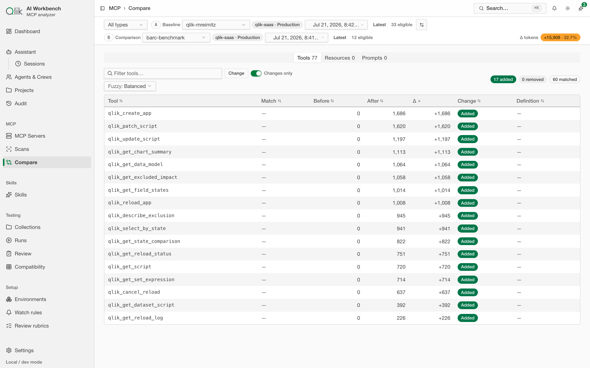

# 5. Compare

Measuring a server once tells you its footprint today. **Comparing** tells you how it changed —
or how it stacks up against a different server. The app does both from the **Compare** screen,
and offers a one-click shortcut for the most common case.

## Two kinds of comparison

- **Over time (same server)** — compare a server against its own earlier scan to see what a
  change did to the footprint. Did adding a tool bloat things? Did trimming descriptions help?
- **Across servers (different servers)** — compare two *different* servers, tool by tool, to see
  where they overlap and which is leaner.

Both work the same way on screen; the only difference is which two scans you pick.

## Compare over time (quickest path)

The fastest way to see what changed is the **Diff vs previous** shortcut on a scan (see
[Scan and read the footprint](../DC-03-scans-and-footprint/04-scan-and-read-footprint.md)). It opens the Compare view with
the current scan and the one before it already selected.

## Compare on the Compare screen

Open **Compare** from the sidebar. You choose two scans — **A** and **B** — and the app lays
out the differences between them. Controls you'll use:

- **Pick A and B** — select a server (and scan) for each side.
- **Swap A and B** — flip the two sides if you picked them the wrong way round.
- **Filter servers by type** — narrow the pickers to one server type.
- **Fuzzy match threshold** — when comparing across servers, tools rarely have identical names,
  so the app matches them by similarity. This slider controls how close two names must be to
  count as "the same tool."
- **Changes only** — hide unchanged rows so you see just what differs.

## Read the comparison

The comparison sorts tools into three buckets:

- **Added** — present in B but not A.
- **Removed** — present in A but not B.
- **Common** — present in both. For these, the app shows the **token delta** (how much cheaper
  or more expensive the tool got) and highlights differences in the description or schema.

Change markers call out each difference, and the totals at the top show the net effect on the
footprint. If the two scans are identical, you'll see a clear **"No differences"** message.

## One important guardrail

The app **will not silently compare two scans that were counted with different
[token profiles](../DC-01-getting-started/01-key-concepts.md)** — the numbers wouldn't be comparable. If your two
scans used different profiles, the app warns you rather than showing a misleading delta.
Re-scan one side with the matching profile to get a clean comparison.

## When to use each

- **Before and after a change** to a server → compare over time and confirm the footprint moved
  the way you expected.
- **Choosing between two servers** that do similar jobs → compare across servers and pick the
  leaner one, or spot tools you could drop.

---

Next: [Run a tool →](../DC-05-tool-playground/06-run-a-tool.md)
