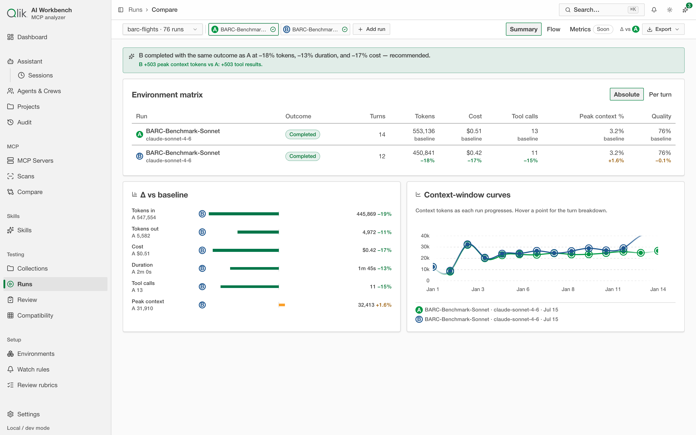
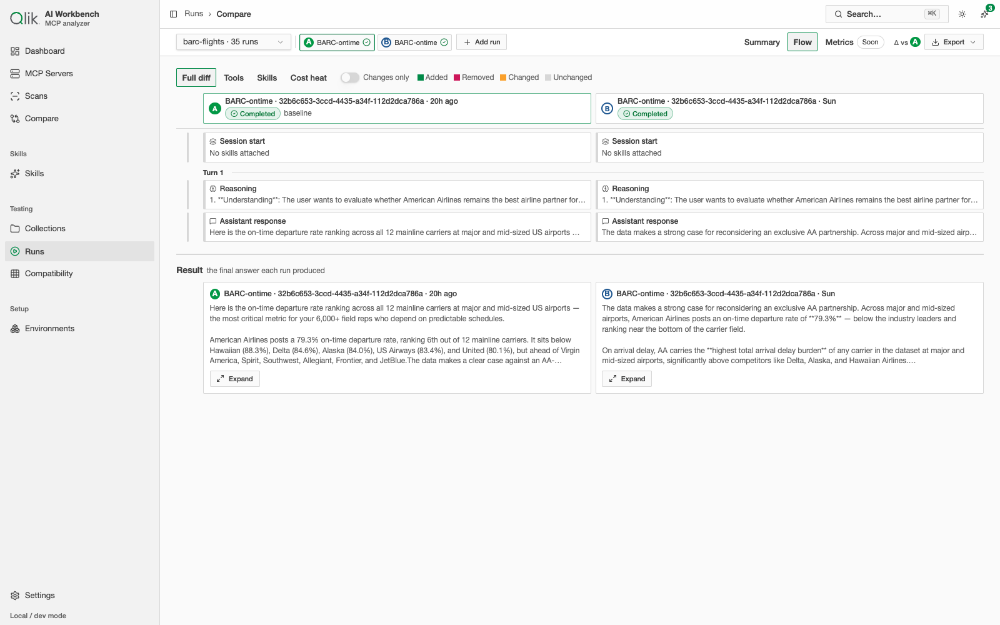

# 10. Comparing runs

Running one session tells you how it went. **Comparing runs** tells you whether one setup is
*better* than another — and that is one of the app's most powerful features. Did a change to a
skill actually help? Is a cheaper model good enough? Does the same task cost less on server B?
Put two (or more) runs side by side and the answer is measured, not guessed.

## Picking runs to compare

Open **Compare runs** from the Runs feed, or the Compare workspace directly. You choose a **test**,
then add at least two of its runs. The first run you add is the **baseline (A)**; every other run
is shown as a delta against it. You can add more than two to compare a whole set at once.

The comparison has two views, **Summary** and **Flow**, selected at the top.

**Consistent status labels** — Every run shown in the comparison displays its status with the same
locked vocabulary used everywhere in the app: `Running`, `Completed`, `Stopped — time limit`,
`Stopped — stalled`, `Rejected by assistant`, and so on. No matter which view you're in, the same
terminal state always reads the same way.

## Summary — the verdict

The **Summary** opens with a plain-language verdict — for example, *"+1.7% tokens, +4.2% cost —
mixed, review before switching"* — so you get the headline before the numbers. Below it:

- an **environment matrix** with each run's outcome, turns, tokens, cost, tool calls, peak context,
  and quality grade, every value shown as a delta from the baseline;
- **Δ vs baseline** bars for the key metrics; and
- **context-window curves** overlaying how each run's context grew, turn by turn.

## Flow — the trace diff

The **Flow** view aligns the two sessions **turn by turn**, side by side, and marks what's the same
and what diverged. You see each run's tool calls, skills loaded, and per-step timings next to each
other, with **added / removed / changed / unchanged** markers. Lenses at the top (**Tools**,
**Skills**, **Cost heat**, **Changes only**) let you focus on one dimension at a time.

This is how you pinpoint *where* two sessions parted ways — the turn where one model called an extra
tool, took a slower path, or read a different skill file.

The Flow view finishes with a **Result** panel that places the **final answer each run produced**
side by side, so you compare not just the path but the outcome. Below, two runs of the same the vendor
Answers assistant are compared on the same question — the reasoning lines up, but the answers differ
in wording and emphasis:

## What to use it for

- **Before and after a change** — compare a run from before your edit against one after it, and
  confirm the footprint, cost, or quality moved the way you intended.
- **Model A vs model B** — run the same test on two models and see the cost/quality trade-off.
- **Skill on vs off** — compare a run with a skill attached against one without, to measure the
  skill's real effect.

---

Next: [App assistant →](../DC-12-app-assistant/12-assistant.md)
