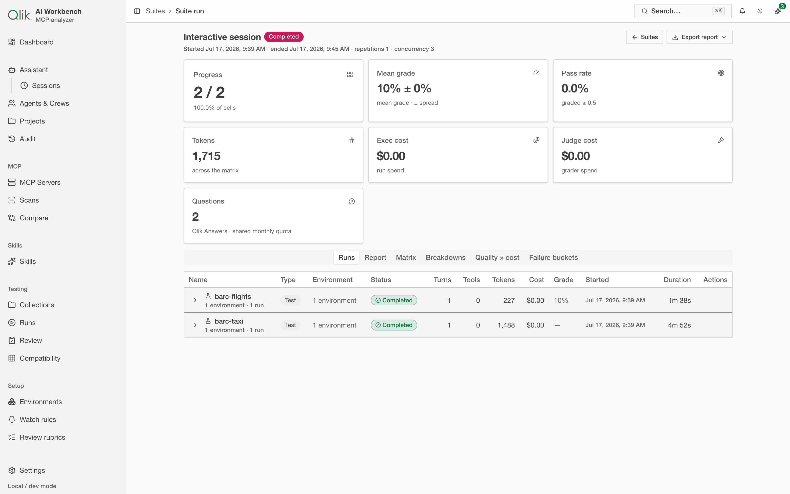

# 18. Suites & benchmarks — run at scale, grade the output

A single run tells you how one session went. A **suite** tells you how a *set* of tests behaves
across models, environments, and repeats — with the answers graded, the costs totted up, and the
variation between runs made visible. This is how you go from "it worked once" to "it works
reliably," and how you compare options head-to-head.

## What a suite run is

A suite runs a **matrix**: every test × every environment × however many repetitions you ask for.
Pick two models and five repeats and you get a grid of runs, executed in parallel, that you can look
at as one result instead of forty separate ones. A **cost cap** can soft-stop a suite before it runs
away.

You launch a suite from **Testing → Runs** (the **Suites** tab) or by saving an ad-hoc run as a
suite. Everything — a single interactive run, a collection, a full suite — goes through the same run
engine, so the numbers are comparable no matter how you started.

## Grading the output

Beyond "did it error," suites grade **answer quality** against the expectations you attach to a test.
Graders include:

- **Answer validation** — did the final answer actually address the prompt (with cited evidence)?
- **LLM judge** — a model scores the answer against a reference or rubric.
- **Tool hygiene** — did the agent use tools sensibly, or thrash?
- **Trajectory vs. reference** — how close was the path taken to a known-good one?
- **Text-overlap graders** for quick, deterministic similarity checks.

Grades and cost sit side by side, so you can ask the question that actually matters — **is this worth
what it costs?** — instead of looking at quality and price in separate places.

## The suite report

When a suite finishes, its report rolls the matrix up: the overall pass rate, how **consistent** the
runs were (variance across repetitions — a flaky test stands out here), where costs went, and how
often the judge agreed with itself. Errors are **clustered** so a single root cause doesn't look like
twenty unrelated failures.

## Skill A/B and Collections

Two suite features are worth calling out:

- **Skill effect (A/B).** Run the same tests with a skill **on** and **off** to measure exactly what
  the skill changed — in quality *and* in token cost. This is the clean way to justify (or retire) a
  skill.
- **Collections** (under **Testing → Collections**) are where tests live. A collection can stay
  local, or bind to a Git repository with **two-way sync**, so a team can version its tests the same
  way it versions code.

---

Next: [Model compatibility →](../DC-10-compatibility/19-compatibility.md)
