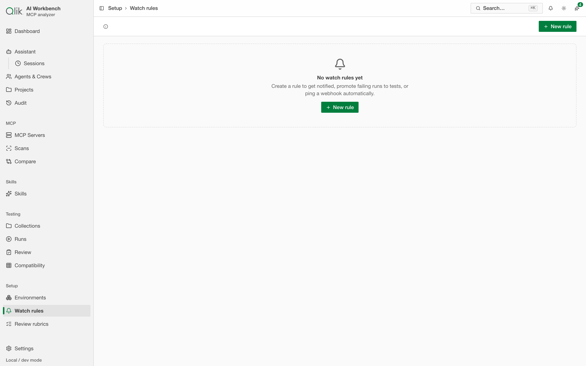
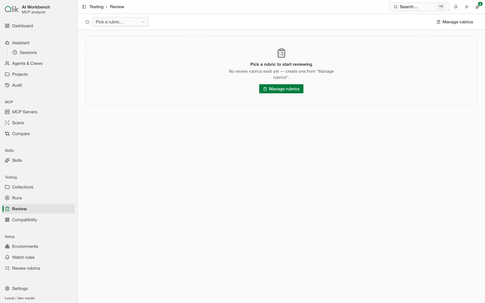

# 17. Observability — watch, review, and catch regressions

Once you run sessions regularly, you want to stay on top of them without watching every one by hand.
Three surfaces do that, and they work together with the Dashboard's **Issues** tab (see
[Getting started](../DC-01-getting-started/02-getting-started.md#the-dashboard)):

- **Watch rules** alert you when a run matches conditions you care about.
- The **Review** queue lets you — or a rubric — judge runs deliberately.
- **Review rubrics** define what "good" means for that review.

Together they turn a growing pile of runs into something you can actually manage.

## Watch rules

A watch rule is a standing alert. You describe what you want to know about — for example, a run that
ends in an error, a run whose cost or context use crosses a threshold, or a pattern that shows up
across a window of recent runs — and the app notifies you when it happens.

- **When they fire.** Rules can evaluate a run the moment it reaches a terminal state, or watch a
  rolling **window** of recent runs for a trend. If the app restarts, windowed rules **catch up** on
  what happened while it was down, so you don't miss anything.
- **How you're notified.** Matches land in the in-app **notification center** (the bell in the top
  bar). A rule can also post to a **webhook** if you want alerts in an outside system.
- **Turn a match into a test.** When a rule catches a run that shouldn't have happened, you can
  **promote that run into a test** so it becomes a repeatable check instead of a one-off surprise.

Find watch rules under **Setup → Watch rules**. New rules start from a run you've already seen, so
you're describing "more like this," not writing conditions from scratch.

## The Review queue

Automatic grading (see [Testing console](../DC-08-testing-console/09-testing.md) and the run **Report** tab) happens on
every run, but sometimes you want a **human** in the loop — to sign off on a batch, to sanity-check
what the automated judge said, or to build a trusted set of examples. The **Review** queue
(under **Testing → Review**) is where you do that: it collects runs to be judged and lets you work
through them against a rubric.

Human feedback you leave here is kept **separate from the automated grades** — it never silently
changes a run's score. It's your record of what you thought, alongside what the graders thought.

## Review rubrics

A **rubric** is the set of criteria a review grades against — the questions you want answered every
time you review a run. Define rubrics under **Setup → Review rubrics**, then point the Review queue
at the one you want. Keeping the criteria in one place means every reviewer (and every automated
pass that uses a rubric) is judging by the same yardstick.

---

Next: [Suites & benchmarks →](../DC-09-suites-and-benchmarks/18-suites-and-benchmarks.md)
