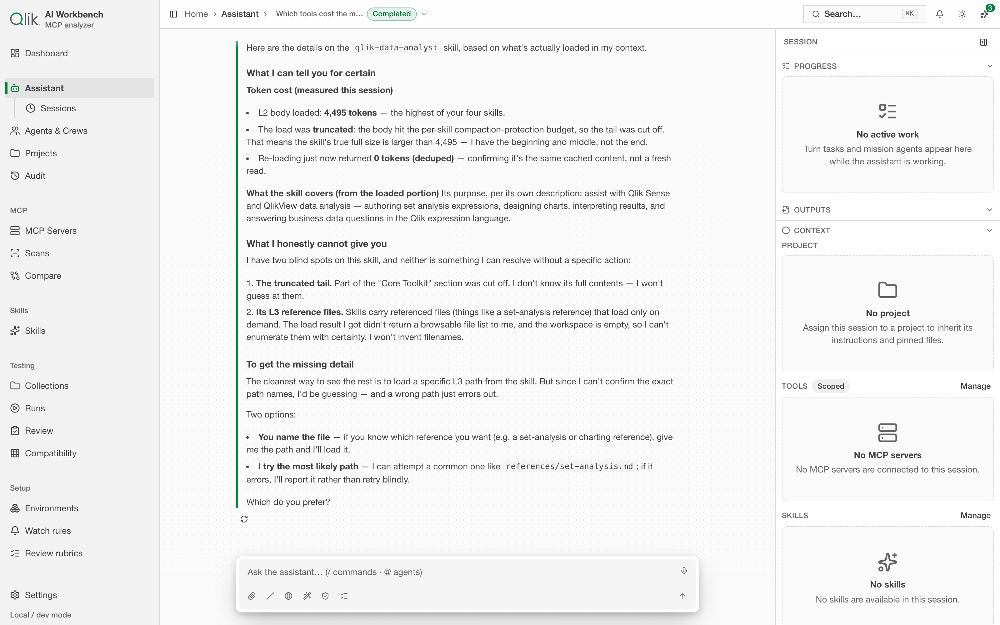
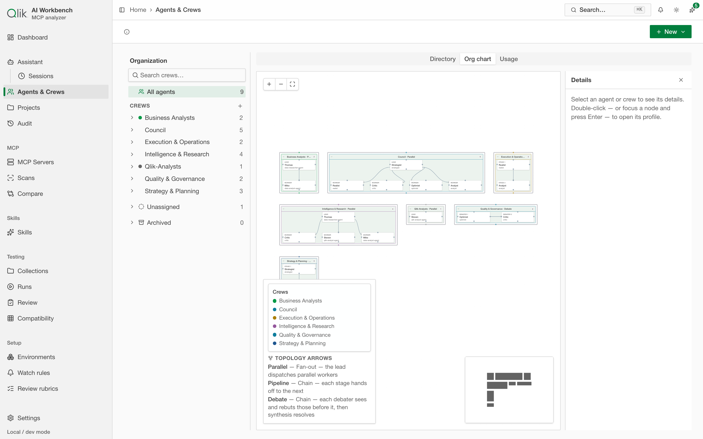

# 16. Assistant Hub

The **Assistant Hub** is a full-page, multi-model, multi-agent AI workspace — a different, larger
surface than the [App assistant](../DC-12-app-assistant/12-assistant.md) dock (labeled **"App assistant"** in Settings).
Where the dock is a lightweight helper that lives in a side panel, the Assistant Hub is a
dedicated screen for real work: multi-turn chat across any of your configured models,
search-grounded research with inline citations, and **missions** — a planner proposes a team of
subagents, you approve it, and they run in parallel (or another topology) and report back with a
synthesized, cited answer.

Its powers come entirely from what you've already registered in the app: **provider credentials**
(any kind — Anthropic, OpenAI, Google, an OpenAI-compatible endpoint, Ollama, or your Claude
subscription), **MCP servers** (and their individual tools), and **skills**. There's no separate
setup — if you've already used [Testing](../DC-08-testing-console/09-testing.md) or [Skills](../DC-07-skills/08-skills.md), the
Assistant Hub reads from the same registry.

## Opening it

Click **Assistant** in the sidebar, directly below **Dashboard**. The workspace is organized in
three zones:

- **Left side**: the active session's conversation. A fresh session opens with a centered composer
  showing a greeting and starter suggestion chips; when you send your first message, the composer
  docks to the bottom (a smooth ~240 ms slide).
- **Right meta rail** (360 px, collapsible sections): shows **Progress** (your step-by-step trace
  through the session), **Outputs** (artifacts and workspace files), and **Context** (memory
  across four scopes, your project's pinned files, and a token gauge broken down by layer —
  system prompt, tool definitions, skills, memory, project, history). Each section collapses
  independently; a master toggle in the toolbar hides the entire rail.
- **Toolbar**: session switcher (jump to recent sessions or view all), model picker (change per
  message or session-wide), and quick actions (settings, plan first, etc.).

## Starting a session: modes

Every new session picks a **mode** up front:

- **Auto** — the default, and the one to reach for when you're not sure. Instead of locking the
  session into one behaviour, the assistant **routes each message**: a plain question gets a direct
  chat answer, a task that genuinely breaks into parallel or adversarial work becomes a **mission
  proposal** (you still approve the plan before anything runs — nothing launches silently), and when
  it's a close call the assistant **asks you first** with a small card — *"Quick answer, or run a
  mission with N agents (≈ \$X)?"* — and does what you pick. You never have to decide the mode
  up front for the whole session.
- **Chat** — a general-purpose, multi-model conversation. Your registered MCP tools and skills are
  available; the model can read and write the session's artifacts and workspace as it works.
- **Research** — the same conversation, tuned for search-grounded answers: the assistant is
  encouraged to cite its sources, and every answer that draws on a tool result gets numbered
  **inline citations**. Research mode needs at least one MCP server capable of search/fetch — see
  [Set up a research server](#set-up-a-research-server-r-mcp13) below if you don't have one yet.
- **Mission** — the multi-agent harness (below). Your first message becomes the mission's ask
  instead of an ordinary chat turn. (Choose this when you already know the task warrants a team;
  otherwise **Auto** proposes one only when it's warranted.)

You also pick a **model** — any model from a hub-eligible provider credential — as the session's
default. You can **switch the model per message** later from the composer, so you're never locked
into one model for the whole conversation.

## The conversation

The workspace is a conversation in the middle with a **meta rail** on the right — Progress (live
mission/task work), Outputs (artifacts the session produced), and Context (the project, MCP servers,
and skills in scope). The breadcrumb names the session, and its status sits beside it.



The composer supports everything a modern chat surface should:

- **Slash commands** (`/`) — jump to a skill, an MCP prompt, or another quick action.
- **Attachments** — upload a file into the conversation; it becomes context the model can read.
- **Plan first** — ask the assistant to propose a short plan and pause for your go-ahead before it
  starts acting (chat/research only — mission mode already has its own plan-and-approve flow).
- **Regenerate / branch** — re-run a turn with a different model or prompt without losing the
  original; both live side by side as selectable variants.
- **Voice input** — dictate instead of typing, where your browser supports it.

Every tool call the assistant makes renders inline as a card: what it's doing, its arguments, and
the result — collapsed to a one-line summary by default, expandable for the full detail. A tool
call that needs your say-so (anything that isn't a first-party, read-only, trusted action) shows
an **approval card** with Approve/Deny before it runs; destructive actions always ask.

### Citations

Any tool result that carries sources — a search hit, a fetched page — becomes a numbered inline
citation (`[1]`, `[2]`, …) in the assistant's answer, with a **Sources** panel listing every
citation for the message and the whole session. Hover a citation for a quick preview of what it
points to.

### The context gauge

The **Context** section in the right meta rail shows a live meter and a full breakdown by layer —
system-prompt sections, tool definitions (loaded now vs. deferred), skill listings, memory,
project context, and conversation history — each with its real measured token cost, using the
same counters the rest of the app uses for scans and runs. This is the same "measure, don't
guess" principle the whole app is built on, now pointed at the Assistant Hub itself. The section
also shows your effective memory stack (which scopes are active and in what order, with the
most-specific winning on conflicts).

## Scoped sessions + tool loading

Tool loading defaults to **auto**: when the granted MCP catalog is small enough to fit the token
threshold it loads **eager** (every tool immediately callable); when it's larger it loads
**deferred-with-promotion** — the model calls `tool_search` to discover a tool, and that tool then
becomes callable on its next step (so MCP tools work either way). Because a full definition set runs
tens of thousands of tokens per server, **scope a session to the servers you actually need**: create
a session → the **"MCP & tools"** tab → switch to **Scoped** → grant just those servers. You can also
change the scope after creation from the **Tools** section of the right meta rail (**Manage**), which
reflects the session's real scope — `Scoped` vs `Auto (all reachable)`. Check the loaded cost any time
in the **Context** section of the rail (it shows the real, measured token cost). Every MCP tool call
shows an approval card regardless of scope.

## Missions: propose → approve → run → synthesize

A mission is how the Assistant handles a task that's bigger than one model call. Start a
mission-mode session, describe what you want done, and:

1. **Propose** — a planner model reads your ask and proposes a team: one or more agents, each with
   a role, a model, the MCP tools and skills they're allowed to use, a budget, and a short
   rationale for why they're on the team. This renders as an editable **plan card**.
2. **Review and adjust** — remove an agent you don't need, or just read the rationale to
   understand the plan. (Hard limits — max agents, max spend — are enforced by the app regardless
   of what the plan proposes.)
3. **Approve** — the agents run. Each gets its own isolated context (its brief, not your whole
   conversation) and works independently.
4. **Watch the board** — a live card per agent shows its status, what it's doing, its token/cost
   ticker, and controls to **stop** or **steer** it (send it a follow-up mid-flight) without
   touching the others. A budget or progress meter tracks the mission as a whole.
5. **Synthesize** — once the agents report back, a final answer is composed from their findings,
   **citing each agent's contribution** (and their own citations, carried through). If the mission
   stopped early or hit a budget, the synthesis says so honestly instead of pretending everything
   finished.

### Topologies

How the team works together is the mission's **topology**, set on the plan (or picked when
starting from a saved crew):

- **Parallel** — every agent works independently at the same time; this is the default.
- **Pipeline** — agents run in order, each stage's report feeding the next agent's brief.
- **Debate** — agents take alternating, adversarial turns on the same question, and a resolver
  settles the disagreement.
- **Best of N** — several agents attempt the same task independently, and a **blind** judge (it
  never sees which model or role produced which attempt) picks the strongest result.

### The autonomy dial

Set per session (chat, research, or mission): **Always ask** waits for your explicit approval
before every mission runs; **Threshold** auto-approves small/cheap missions and asks for anything
above a configured agent-count or cost ceiling; **Auto** never asks. Hard caps on agent count and
total spend apply no matter what the dial says.

## Agents & Crews

Open **Agents & Crews** from the sidebar (under Assistant) to manage your workforce. The page has
three tabs:

### Directory

A searchable card grid of all agents and crews. Click a card to select it (highlighted border); click
again, press Enter, or use the ⋯ menu to open its profile. A quick-create form (≤6 fields) appears
at the top for creating a new agent on the fly; after creation, the new profile opens automatically
so you can configure it fully.


**Agents** are reusable role definitions the planner draws from (it can still improvise a role on
the fly when nothing in the library fits). A profile shows eight sections:

- **Profile** — name (displayed), role (internal ID), and one-line description
- **Instructions** — the system prompt that tells this agent how to behave
- **Model** — the default model for this agent
- **Access** — which MCP servers and individual tools this agent can use, with per-tool token costs
  visible (pull from the latest server scan) and a running footprint total of the granted set
- **Skills** — which skills this agent has access to
- **Memory** — this agent's private memory (separate from global profile memory)
- **Budgets** — token and cost limits
- **Usage** — a 30-day strip chart of this agent's spend

**Crews** are named teams — a set of agents plus a topology (parallel, pipeline, debate, or
best-of-N) — you or the planner can instantiate as a mission in one step, skipping the planning
call entirely. Each crew has a distinct color (from the chart palette) that appears as a small
accent: a dot next to the crew's name, a ring on the avatar, and a top border on the crew card in
the Directory. A crew profile shows:

- **Profile** — crew name and one-line description
- **Members** — the agents in this crew and their roles
- **Topology** — how they work together (parallel, pipeline, debate, best-of-N)
- **Budgets** — team-level token and cost limits
- **Memory** — the crew's shared memory
- **Usage** — a 30-day strip chart of the crew's total spend

### Org chart

A visual graph of your agents and crews. Each crew is a tinted group box (tinted by the crew's
color); agents are nodes. Edges inside a crew show the execution topology — a pipeline chain, a
parallel fan-out, a debate pair, or a best-of-N fan-in. Multi-crew agents appear as separate
nodes in each crew's group, with stacked color dots showing all their crew memberships.

Click a node to select it or navigate into its profile.



### Usage

A 30-day breakdown of your spending, with controls to group by agent, crew, model, project, or
session mode. A ranked table shows each entity's cost, token consumption, and counts. Click a row
to drill into that entity's own usage detail (e.g., an agent's sub-page within its profile), or
use the toolbar "View sessions" action to jump to the **Sessions** table filtered by your current
date range and project narrowing.

## Skills in a session

Attach a skill to a session (or bundle it into a role) from the session's settings. A skill's name
and description are always visible to the model at low cost; its full content loads only when the
model actually invokes it (or, for a role-level skill, is preloaded into that agent's brief). Every
skill's session cost is itemized in the context inspector, using the app's existing skill
token-footprint counters — [Skills](../DC-07-skills/08-skills.md) covers where those numbers come from. Skills
are always read-only context here too: the Assistant never executes a skill.

## Artifacts

When the assistant produces a real deliverable — a document, a piece of code, an HTML page — it
becomes a versioned **artifact** in the session's canvas (open it from **Show artifacts** in the
header) rather than getting buried in the transcript. Each new version is kept, so you can diff
any two versions or **revert** to an earlier one. A **review** workflow lets a critic role propose
anchored comments and suggested edits, which you accept or reject one at a time — each acceptance
becomes a new version.

Export an artifact as Markdown, HTML, or JSON, or as a **self-contained `share.html`** — one file
with everything inlined (styles, citations as footnotes) that opens correctly in any browser with
no app or network dependency, for sending to someone who doesn't have the app.

## Memory and projects

Memory is scoped into four tiers:

- **Profile** — your global preferences, standing instructions, and recurring context. Managed from
  the **Context** section in the workspace meta rail (a dialog button opens the full editor).
- **Project** — team instructions and shared context for a recurring body of work (e.g. "Q3 server
  audit"); inherited by every session in that project. Edited from within each project's detail page.
- **Agent** — private memory for a specific agent or crew, visible only when that agent is running.
  Edited from the agent/crew profile's **Memory** section.
- **Crew** — shared memory for a crew, visible when any member of that crew runs. Also in the
  profile's **Memory** section.

The assistant may **propose** saving something ("Save to memory?") but never writes silently; you
decide. When you run a session, the **Context** section shows your **effective memory stack** —
which scopes are active in what order, with the most specific (agent/crew > project > profile)
winning on conflicts. Nothing injected into a conversation is hidden from you.

**Projects** — group related sessions and give them shared instructions and pinned files every
session in the project inherits. Create a project from the **Projects** page (a sibling of **Agents &
Crews** and **Audit** in the sidebar), then pick it when you start a new session.

## Sessions, usage, and audit

- **Sessions** — open **Assistant → Sessions** in the sidebar to see a searchable, sortable table of
  all your sessions. Columns show status, mode, project, model, turn count, token consumption,
  cost, last update, and any errors. Click a row to open that session. You can also archive old
  sessions to clean up the list.
- **Usage** — available as the **Usage** tab within the **Agents & Crews** page (described above).
  If you had a standalone usage page before, bookmarks to `/assistant/usage` redirect here.
- **Audit** — open **Assistant → Audit** in the sidebar to see a global filterable timeline of
  every tool call, approval, agent spawn, and model call across all sessions. Group by day (sticky
  headers), filter by kind, tool, or session, and search by keywords. Agent-identity enrichment
  shows which crew an agent belongs to (when available), and each row links back into the exact
  session and message for replay.

## Approvals and elicitation

Beyond the approval cards described above, some tools ask the assistant a direct question mid-run
(an MCP **elicitation**) — for example, to disambiguate a choice. This renders as a real form (or,
for a URL-based request, a clearly labeled link that's never auto-opened) right in the
conversation; the session waits for your answer before continuing, and you can always decline.

## Set up a research server (R-MCP13)

Research mode and any mission that needs to search the web depend on an MCP server that can
search or fetch pages — the app ships **no built-in search engine and no bundled API key**
(your provider credentials work the same way: bring your own key). To make this easy, the
**Add MCP server** wizard offers a **"Quick start: research servers"** picker with ready-to-fill
templates for a few well-known search MCP servers:

| Server | What it does | Env variable |
| --- | --- | --- |
| **Tavily** | Web search + page extraction, built for LLM agents. | `TAVILY_API_KEY` |
| **Brave Search** | Web + local search over the Brave Search API. | `BRAVE_API_KEY` |
| **Exa** | Neural search + page content, tuned for research agents. | `EXA_API_KEY` |

To use one: go to **MCP Servers → Add MCP server**, click the preset (e.g. **Tavily**) at the top
of the wizard — it prefills the command and the expected environment variable name — then paste
your own API key (get one from the provider's site) into the **Environment variables** field and
finish the wizard like any other [stdio (local command) server](../DC-02-mcp-servers/03-connect-a-server.md).
Your key is encrypted before it's saved, exactly like every other server credential in the app.

Once a server like this is registered, it's automatically available to every Assistant session
(server-level access is granted per session, not hand-picked per message). If you open Research
mode and none of your registered servers look search-capable, the conversation's empty state
offers this same **Add MCP server** shortcut.

## Reading & exporting a session log

Every Assistant session is stored as an **append-only event log** — every message, tool call,
reasoning step, question, and phase, in order. The whole session is reconstructible from that log
alone, which makes it easy to export or inspect.

### Export from the UI

Open a session, then in the right-hand **Context** rail (below **Effective memory**) use the
**Export session** dropdown to download the full transcript as either **Markdown** (`.md`, a
human-readable transcript) or **JSON** (`.json`, the complete raw event log). Both contain *every*
input and output in sequence — nothing is summarized away.

### Read a session from the command line

To dump a session's transcript without opening the UI (handy for debugging), point the helper at a
running instance:

```bash
node scripts/dump-hub-session.mjs <sessionId>            # Markdown to stdout
node scripts/dump-hub-session.mjs <sessionId> --json     # raw JSON event log
node scripts/dump-hub-session.mjs <sessionId> --out /tmp/session.md
```

The session id is in the URL when a session is open (`/assistant?session=<sessionId>`). It uses the
same export endpoints as the UI dropdown, so it needs no database access.

### Inspect the raw log (deep debugging)

For low-level debugging you can query the SQLite log directly. In Docker the database lives in the
container's data volume:

```bash
docker cp mcp-token-footprint-mcp-token-footprint-1:/data/app.sqlite /tmp/x.sqlite
sqlite3 /tmp/x.sqlite \
  "SELECT seq, type, payload_json FROM hub_events WHERE session_id='<id>' ORDER BY seq;"
```

Copy `app.sqlite-wal` and `app.sqlite-shm` alongside it — the live database runs in WAL mode, so
the newest events may still be in the write-ahead log.
