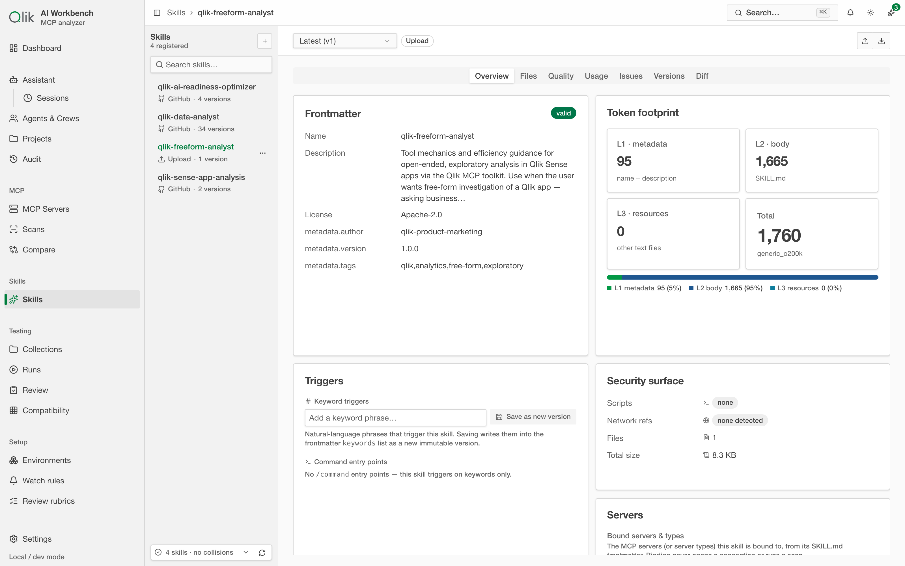

# 8. Skills (overview)

Beyond analyzing MCP servers, the app includes a **Skills** area for working with *Agent
Skills*. This page is a short overview so you know what the area is for; the core analyzer
workflows (servers, scans, compare) are covered in the earlier pages.

## What is an Agent Skill?

An **Agent Skill** is a self-contained bundle of instructions and files (centered on a
`SKILL.md` file) that gives an AI assistant a reusable capability — a way of doing a particular
kind of task. Like MCP tools, skills add to what a model has to load, so they too have a **token
footprint** worth measuring.

## What you can do here

Open **Skills** from the sidebar.

### Register a skill

Add a skill in one of two ways:

- **Upload** a `.zip` bundle or a lone `SKILL.md` file.
- **Import from GitHub** by pointing the app at a repository.

The app keeps every registration as an immutable **version**, so you build up a history. For
GitHub-sourced skills, you can **pull the latest** at any time, which is saved as a new version.

### Inspect a skill

The inspector shows you everything about a skill without running it:

- The **rendered `SKILL.md`**, formatted for reading.
- The **token footprint**, broken into levels (often called L1/L2/L3) so you can see how much
  loads up front versus on demand.
- A **security surface** — which files contain scripts, what languages they use, whether they
  reference the network, and the overall file and byte totals.
- A **file explorer** to browse the bundle, the **version list**, and a **diff** between any two
  versions.

> Skills are **stored but never executed** by the app. Inspecting a skill only reads its
> contents; it never runs any scripts inside it.

### Attach a skill to a test

You can attach a skill to a testing environment so it's included when you drive a server through
an agent loop (see [Testing](./09-testing.md)) — either always the latest version, or a pinned
one. This lets you measure a skill's effect on a run.

## The feedback loop: issues filed against a skill

This is where the "closed-loop test-and-fix" story comes together. When a run fails or is rated
poorly and a skill was involved, the app **files an issue against that skill** — you'll see a count
on the skill's **Issues** tab. Each issue carries a severity, a plain-language description of what
went wrong, a **drafted fix**, and a link back to the exact run where it happened.

From here you can **Resolve** the issue yourself, or hand it to the [Assistant](./12-assistant.md)
with **Fix with assistant** — which edits the skill and saves the result as a new immutable version.
That's the full loop: a session surfaces a problem, the problem lands on the skill as a concrete,
tracked issue with a drafted fix, and the fix flows back into a new version you can re-test. Issues
can also be exported (Markdown or JSON) to take into your own workflow.

---

Next: [Testing console →](./09-testing.md)
