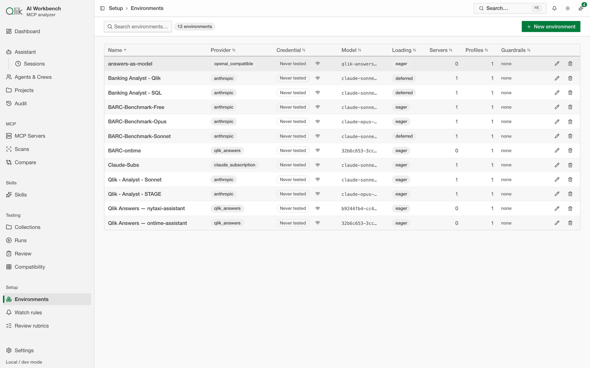
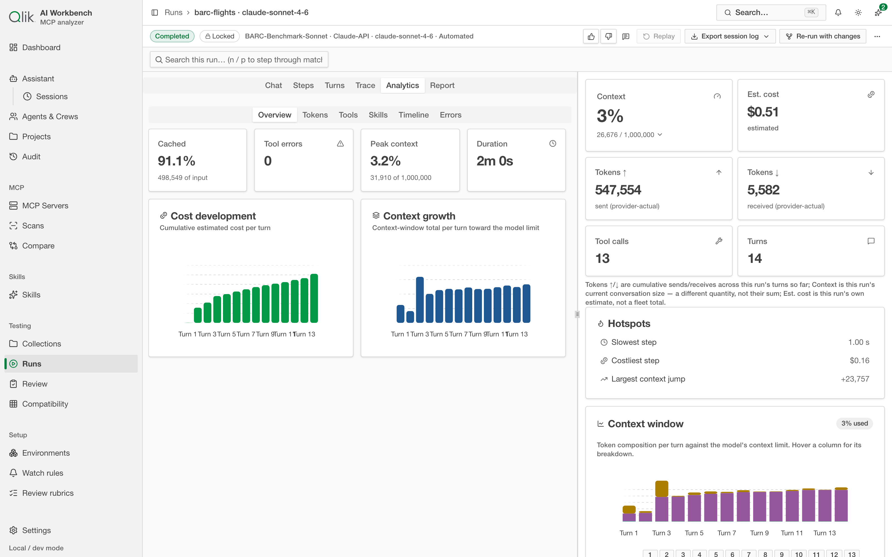

# 9. Testing console — run a real session

Scanning tells you what a server *costs to load*. The **Testing console** goes further: it drives
a server through a **real AI agent loop** — an actual model using the server's tools (and any
attached [skills](./08-skills.md)) to work through a task — and records everything that happens.
This is where you see how skills and servers behave *together*, debug a session, and measure what
it really costs. It's the heart of the "session workbench."

## What a run is

A **run** is one AI session, captured start to finish. A model is given a task, reads the tool
and skill definitions, then works — thinking, calling tools, reading results — until it produces
an answer. The console records every step so you can replay and inspect it later.

Because a run drives a real model, you first add a **provider credential** (an API key, or your
Claude subscription) in [Settings](./13-settings.md). Keys are encrypted before they're saved, and
a model with no known price can't be run, so cost figures stay honest.

## The building blocks

The **Testing** and **Setup** groups in the sidebar hold a few surfaces that work together:

- **Environments** — a reusable configuration for a run: which provider and model to use, which
  server(s) and [skills](./08-skills.md) to include, whether tools load eagerly or on demand, and
  any guardrails. (Internally an environment is sometimes called a "scenario.")
- **Collections** — where your tests live. There's always a default collection named **Local**;
  binding a collection to a git repository is optional.
- **Runs** — the feed of every run, with columns for status, turns, tools, tokens, cost, and the
  automatic quality grade.

Notice the **Provider** column above: every configured provider — a metered API key or the signed-in
Claude subscription — is a valid run target.

## Sessions and runs — what's which

The app uses two terms carefully: a **session** is an interactive container — you start it, watch
it work, and can ask it to stop. An automated, suite-driven execution is a **run**. The API still
calls everything `runs` under the hood, but the UI uses the right term for what you're watching:
"Starting a session…" for interactive work, "Session waiting for you" when it needs input.

## Starting a run

Choose **New run**, pick an environment and a test (or type an ad-hoc prompt), and start it. The
run opens in the **run console**, which streams the session live and then keeps the full record.

### Status and timers

Every session has a **status** drawn from a locked vocabulary applied consistently across every
surface — the runs feed, the console, comparison views, and reports. The same session state always
reads the same way: `Queued` (plus position in the queue), `Pending`, `Running`, `Waiting for you`,
`Stopping…`, `Reviewing…`, `Completed`, `Ended`, `Stopped — time limit`, `Stopped — stalled`,
`Stopped — context overflow`, `Stopped — wait timeout`, `Stopped by you`, `Failed`, and
`Assertions failed`. The app also shows cost/token/tool limits when they're hit.

The **wait timeout** is how long a session will wait for you to provide input. By default it's
**10 minutes** — if you don't respond in that time, the session ends with `Stopped — wait timeout`.
You can change these defaults in
**Settings → Testing**, and override them per environment. While waiting, the session's active
timer pauses — it resumes when you respond — so a lunch break doesn't count against your run's
cost.

The **stall detector** kicks in after **10 minutes with no events** while a session is running.
If the session goes silent — hung MCP server, unresponsive network, anything — it's stopped with
`Stopped — stalled`. This is opt-in per environment via the **max duration** cap (set it to enable
stall detection as well). The **active duration** shown in the KPI rail excludes waiting time;
the **total duration** is wall-clock.

### Ending a session

Interactive sessions can be ended explicitly. From the run console, click **End session**, confirm
in the dialog, and the session finishes as `Ended` — a clean close, not a guardrail stop. This is
the way to say "I got what I needed" or "I'm done exploring."

### Needs attention — sessions waiting for you

The runs feed has a dedicated **Needs attention** section that shows sessions currently waiting
for input, and finished sessions you haven't seen yet. Opening one marks it seen, so you always
know which sessions need a look.

### Launcher effective limits

Before starting a run, the launcher shows an **effective limits** summary: the stall timeout, wait
budget, wall-clock cap (if set), and the subscription run concurrency this session will be subject
to. This tells you upfront what constraints will apply.

## The run console

The console is one screen with the session on the left, a **KPI rail** on the right (context used,
estimated cost, tokens in/out, tool calls, turns), a **context-window chart** showing how each turn
fills the model's limit, and a per-turn list. Four tabs move between different views of the same run.

### Chat — the conversation

The **Chat** tab reads like a transcript: the task prompt, the model's thinking, each tool call
with its arguments and result, and the final answer. This is the quickest way to understand *what
the assistant did and why*.

### Trace — the event timeline (for debugging)

The **Trace** tab is the debugger. It breaks the session into a turn-by-turn tree of events — user
prompt, LLM response, each tool call — each stamped with tokens in/out, duration, cost, and time.
When a session is slow, expensive, or goes wrong, this is where you find the exact step responsible.

### Analytics — cost and context

The **Analytics** tab summarizes the run: how much was served from cache, tool errors, peak context
used against the model's limit, and total duration — plus charts of **cost per turn** and **context
growth per turn** so you can see where the budget went.

### Report — automatic quality rating

When a run finishes, the app **reviews it automatically** — a core part of the automated
issue-detection story. The **Report** tab shows whether the answer actually addressed the task
(with the judge's cited evidence), whether it added useful or wasteful extra content, and an **error
forensics** inventory that classifies anything that went wrong and drafts a fix. You can re-rate at
any time.

When that review implicates a skill, the finding doesn't just sit in the report — it's filed as a
tracked **issue against the skill itself**, with a drafted fix. That closed loop is described in
[Skills → the feedback loop](./08-skills.md).

## Replay

Any finished run can be **replayed** step by step from its saved record — useful for walking a
colleague or customer through exactly what happened, without re-running anything.

## Will it even fit? (Compatibility)

Before you spend tokens on a run, the **Compatibility** screen answers a related question: does a
server's footprint fit inside a given model's context limit? It scores a scan against a roster of
models as a heatmap. See [Model compatibility](./19-compatibility.md) for the full walkthrough.

## Reviewing runs at scale

Two things help once you've run more than a handful of sessions:

- The **Runs** feed is searchable and filterable — narrow by prompt, tool, status, or cost, and save
  a filter as a **view** you can return to.
- To run many tests at once and grade the answers, move up to a **suite** — see
  [Suites & benchmarks](./18-suites-and-benchmarks.md). To keep a standing eye on what's breaking,
  see [Observability](./17-observability.md).

---

Next: [Comparing runs →](./10-comparing-runs.md)
