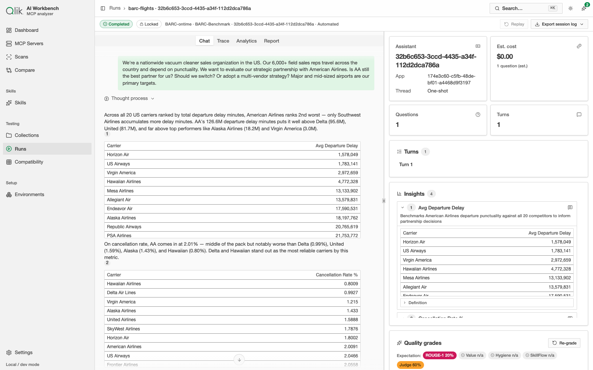
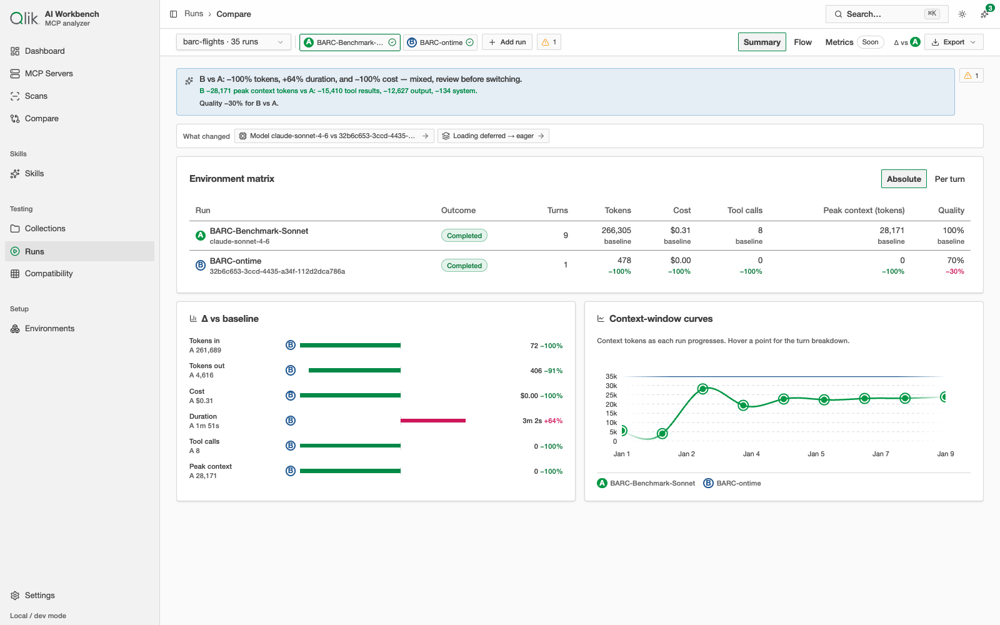

# 11. Qlik Answers as a model

There are two very different ways to answer a data question. One is a general model equipped with
**MCP tools** — an agent that queries the data itself over several turns. The other is a
purpose-built **Qlik Answers** assistant that already knows the data. A standout capability of this
app is that it can treat a **Qlik Answers assistant as if it were a model**, run it against the same
tests as your MCP setups, and **compare the two head to head**.

## Why this matters

If you're deciding how to serve a question — build an agent with MCP tools, or point people at a
Qlik Answers assistant — you want evidence, not opinions. Running both through the same test lets
you weigh the trade-offs directly: cost, effort (turns and tool calls), context used, and answer
quality.

## Setting it up

Qlik Answers is a **provider kind**, so you configure it as an [environment](./09-testing.md) just
like a model: point it at a Qlik Answers assistant on your tenant. A few things are specific to it:

- The session runs **clean** — a Qlik Answers assistant answers on its own, so no MCP servers or
  skills are attached.
- Cost is measured in **questions consumed**, not tokens. The Qlik Answers API doesn't report token
  usage, so any token figures shown are estimates and the console leads with questions instead.
- The session has a **wait timeout** — Qlik Answers defaults to a **30-minute wait** for user input
  (longer than the default 10-minute wait for other provider types). You can override it per
  environment.

## Running a Qlik Answers session

A Qlik Answers run opens in the same [run console](./09-testing.md), but tuned to how the assistant
responds. The answer is shown with its **Insights** — the underlying data (hypercube tables) the
assistant used — and citations back to those sources. The KPI rail is question-first: it shows the
**assistant** and **app**, the **thread** (a Qlik Answers session is typically one-shot), the number
of **questions** consumed, and the automatic **quality grades**.

### The assistant identity card and token estimates

At the top of the console, the **assistant identity card** displays the assistant's name and
version (from the Qlik Cloud metadata). The **KPI rail tiles** show estimated token counts
(marked "estimated" in the UI, since the Qlik Answers API does not report real token usage — these
are the same estimates the app uses for all its token accounting). There is **no context-window
panel** for Qlik Answers, because Qlik Answers operates on its own context budget, not yours — it
just consumes questions from your tenant's quota.

### Guardrails and status

If a Qlik Answers assistant declines to answer (e.g. a guardrail rejects the prompt), the run
finishes with status `Rejected by assistant`, visible in the runs feed and every detail view
alongside other terminal states.

## Comparing Qlik Answers against an MCP session

This is where it pays off. Run the *same* test against a Qlik Answers environment and an MCP
environment, then [compare the two runs](./10-comparing-runs.md). Because both answered the same
question, the differences are apples to apples.

In the example above, both were asked the same airline-partnership question:

- The **MCP session** (a Claude model driving Qlik MCP tools) worked through **9 turns**, used about
  **266,000 tokens** and **8 tool calls**, cost roughly **$0.31**, and scored **100%** on the task.
- The **Qlik Answers assistant** answered in a **single turn** with essentially **no context cost**
  and **$0.00** measured spend, but scored **70%**.

The comparison makes the trade-off concrete: the assistant is dramatically cheaper and simpler,
while the agent-with-tools did more work and scored higher on this particular question. Which is
"better" depends on your priorities — and now you can decide from measurements.

## Calling a Qlik Answers assistant from outside this app

If you want to run a Qlik Answers assistant from another tool — a chat UI, an evaluation
framework, or your own script — the app exposes the assistant as an
**[OpenAI-compatible endpoint](./15-openai-endpoint.md)**. Point any client that speaks the
standard Chat Completions protocol at the app, and it can chat with the assistant without
Qlik-specific integration on the client side. Runs made through that endpoint are tracked the
same way as interactive runs and appear in your Runs feed.

## What to use it for

- **Choose an approach** — purpose-built assistant vs. agent-with-tools — for a given class of
  question.
- **Benchmark an assistant's answer quality** against a known-good agent run.
- **Show a customer the trade-off** in concrete numbers rather than in the abstract.

---

Next: [Assistant →](./12-assistant.md)
