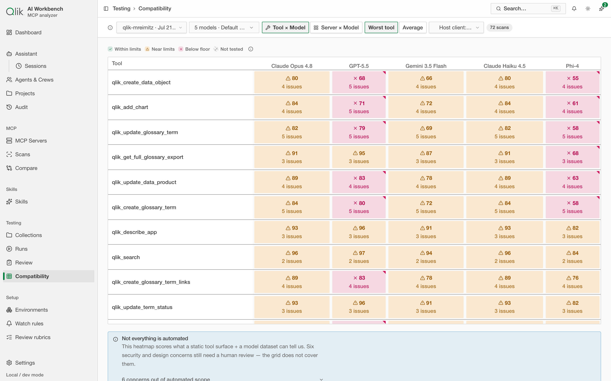

# 19. Model compatibility — will this server fit?

A tool surface that's comfortable for one model can overflow another. **Compatibility** (under
**Testing → Compatibility**) answers a specific question: given a server's scanned tools and a set of
models, **does it fit, and where does it strain?** — before you spend a single token on a real run.

## The heatmap

Pick a scan and a roster of models and the app builds a grid. You can look at it two ways:

- **Tool × Model** — every tool scored against every model, so you can see exactly which tools push a
  given model toward its limit.
- **Server × Model** — the whole server's footprint against each model, for the big picture.

Every cell is scored and colour-coded:

- **Within limits** — comfortable.
- **Near limits** — fits, but with little headroom; watch this one.
- **Below floor** — doesn't fit; this combination will fail or force truncation.
- **Not tested** — outside the evaluated set.

Each cell also carries an **issue count**, so a tight fit and a specific problem (an oversized schema,
a name that's too long for the host's prefix budget) are both visible at a glance.

## What it can and can't tell you

The heatmap scores what a **static tool surface plus a model dataset** can reveal — sizes, limits,
schema shape, name lengths. That catches the mechanical problems early and cheaply.

It is deliberately honest about its edges: a handful of security and design concerns **still need a
human review** — the grid flags that they exist and are out of automated scope rather than pretending
to have checked them. Use the heatmap to clear the mechanical hurdles, then use a real
[test run](./09-testing.md) and [Review](./17-observability.md#the-review-queue) for the judgment
calls.

---

Next: [App assistant →](./12-assistant.md)
