# AI Workbench

## Understand, test, and trust every AI session — before it reaches a user.

Your AI assistants don't work alone. They lean on **MCP servers** for tools and **Agent Skills**
for know-how, and everything those pieces contribute lands in the model's limited context and
shapes how a session behaves. AI Workbench is where you see all of it clearly: measure what each
piece costs, watch a real session play out step by step, **grade every run automatically**, and
**compare anything against anything** — one model against another, a skill on against off, or a
two agent configurations head-to-head.

It runs entirely on your own machine. Your servers, your credentials, your data — nothing leaves it.

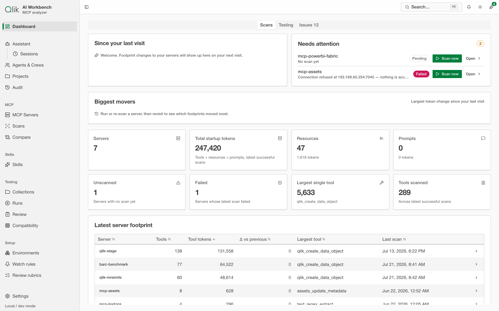

> **Real tokenizers, not guesses · a real multi-provider agent loop · automatic grading on every
> run · apples-to-apples comparison across models and skills.**

---

## Why teams reach for it

Three problems quietly cost you time, money, and trust:

**The context budget disappears.** Before an assistant answers anything, every tool and skill
definition is loaded into the model's context. A bloated server can eat a huge slice of the budget
before real work begins — and you can't fix what you can't see.

**Sessions fail in ways you can't inspect.** When an answer is wrong, slow, or expensive, the cause
is buried inside the run: a tool that misfired, a skill that didn't load, a step that ballooned the
context. Without a record, it's guesswork.

**You're choosing approaches blind.** Agent-with-tools or a purpose-built assistant? Model A or model
B? Skill or no skill? These are cost-and-quality trade-offs — and most teams decide them on intuition.

AI Workbench turns all three into something measured, reproducible, and comparable.

---

## Built for everyone who touches the setup

**Operators and end users** get a clear picture of how their skills and servers fit together and what
each one costs — no more guessing why an assistant behaves the way it does.

**Presales, CSEs, and technical field teams** can debug a session end to end, point to exactly where
an issue is, and show a customer the evidence instead of hand-waving.

**Skill and MCP developers** get automated issue detection, drafted fixes, and a closed test-and-fix
loop — turning "something's wrong" into a reproducible problem and a proven fix.

**MCP server owners** analyze and validate their servers, track how every change affects real
sessions, and run long-running quality gates so regressions surface early — not in front of a user.

---

## See the entire session — not just the answer

Every run is captured start to finish and opens in a live console. The conversation reads like a
transcript: the task, the model's reasoning, each tool call with its arguments and result, and the
final answer. A KPI rail and a context-window chart sit alongside, so cost and context are never
more than a glance away.

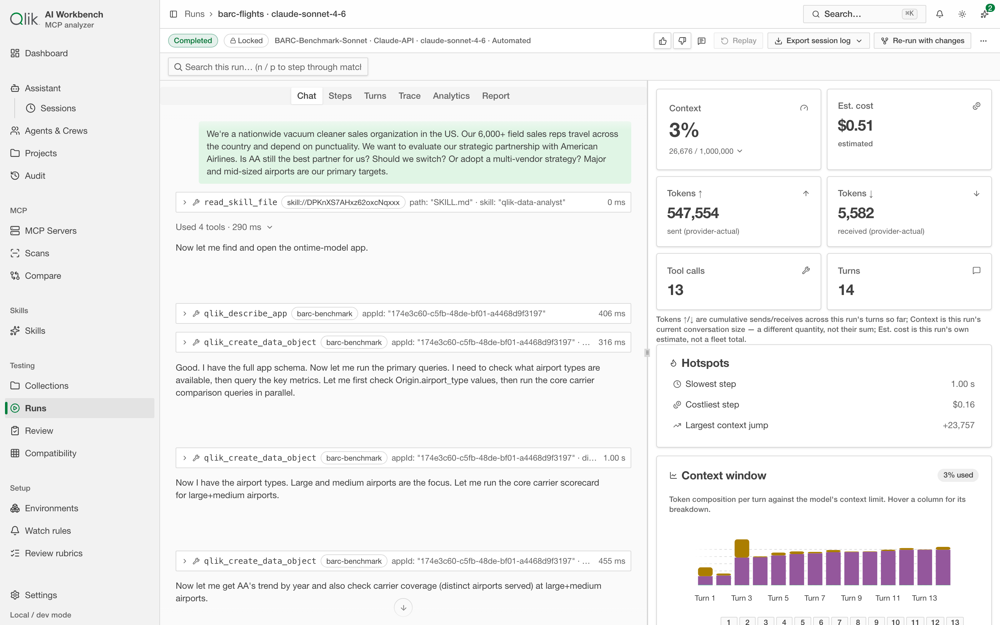

**Every number that matters, at a glance.** Context used against the model's limit, estimated cost,
provider-actual tokens in and out, tool calls, and turns — live, per run.

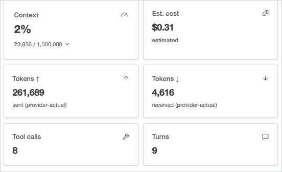

**Watch the context fill up, turn by turn.** The context-window chart breaks every turn into system,
tool definitions, history, tool results, and output — so you can see exactly what's consuming the
budget.

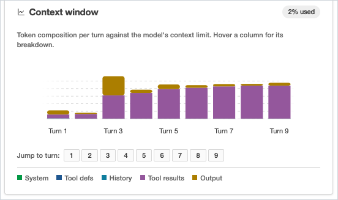

**Debug at the event level.** The Trace view expands the session into a turn-by-turn tree — prompt,
LLM response, every tool call — each stamped with tokens, duration, and cost. When a run goes wrong,
this is where you find the exact step responsible.

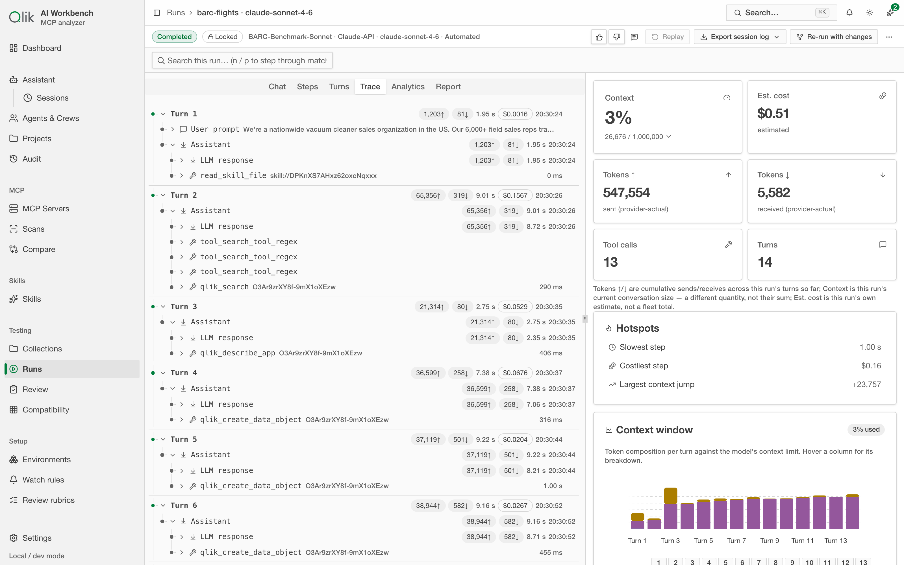

---

## Measure the footprint the way a model does

Point AI Workbench at any MCP server and it pulls in the full surface — tools, resources, prompts —
and measures the token cost of each, using **real tokenizers** (the same math the models use), not
rough estimates. Tools rank from most to least expensive, so the few that dominate the budget are
obvious.

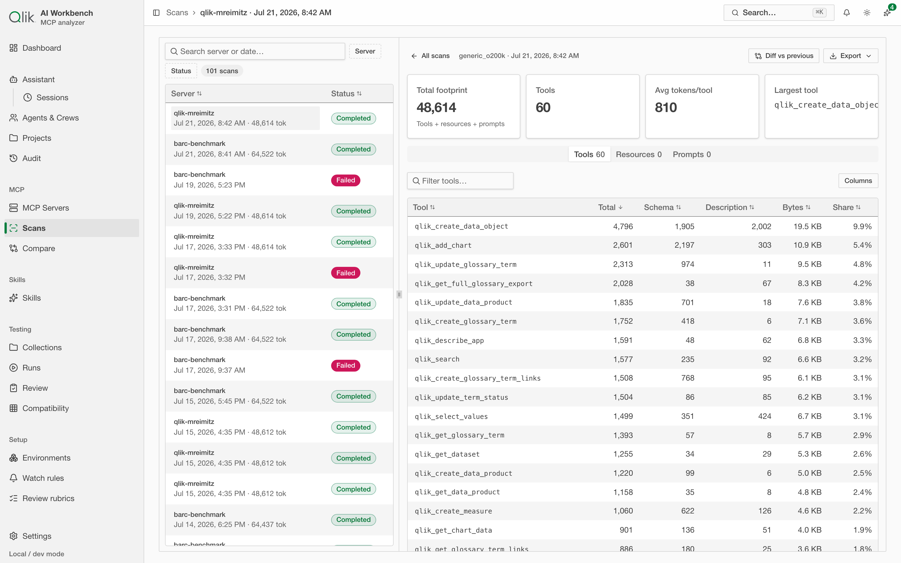

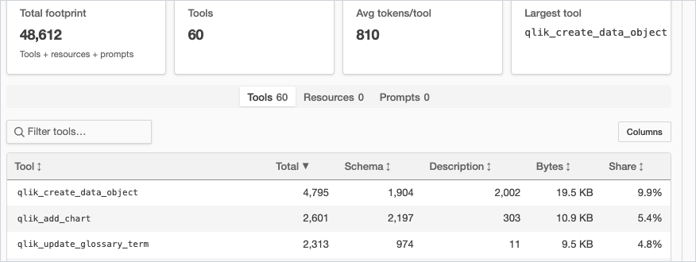

**It also tells you what to fix.** Automated findings flag what breaks across models and where you can
recover tokens — ranked most-severe-first, with the exact tokens you'd win back.

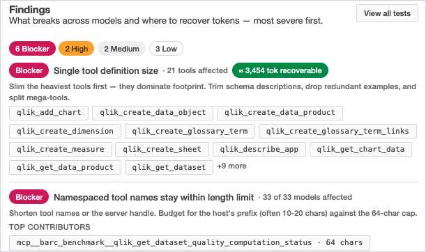

---

## Every run is graded — automatically

This is what makes AI Workbench more than a viewer. **The moment a run finishes, it's rated** — no
setup, no reference answer required. That grade is what turns a pile of sessions into something you
can rank, trust, and compare.

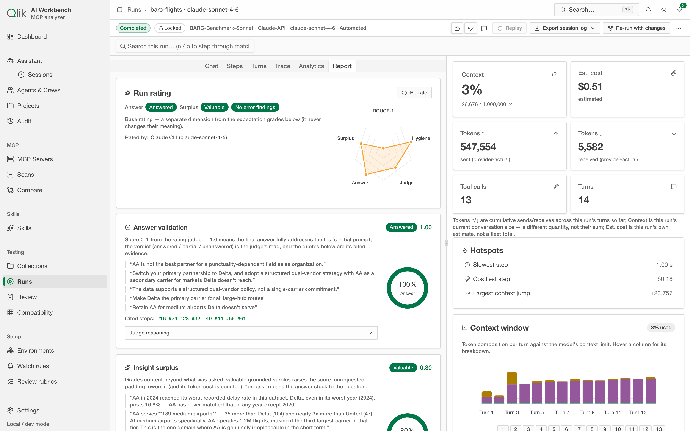

### The base rating: three dimensions, on every run

**Answer validation** asks the essential question — did the final answer actually address the task?
You get a verdict (answered / partial / unanswered) and a 0–1 score, backed by **quotes lifted
straight from the transcript** as cited evidence. No black-box scores.

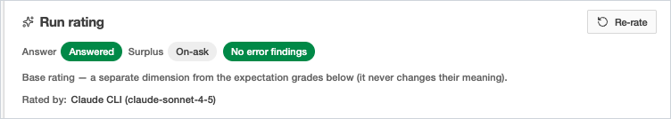

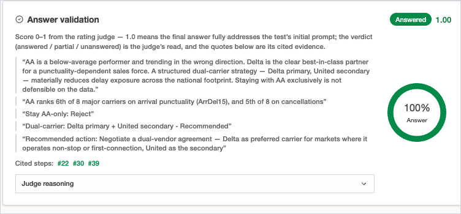

**Insight surplus** grades what the answer added beyond the ask. Grounded, useful surplus raises the
score; unrequested padding — which also costs tokens — lowers it.

**Error forensics** is a deterministic inventory of everything that went wrong: errors, failed tool
calls, guardrail stops, context overflow, failed assertions. Each finding is classified by root
cause, pointed at the skill or server responsible, and paired with a drafted fix.

The whole rating is produced by a **Claude-first judge chain** (with a provider-judge and
deterministic-only fallback), so it works whether or not you've wired up an external judge.

### Expectation grades: when you know what "good" looks like

Attach expectations to a test and every run is also scored against them:

| Grade | What it measures |
| --- | --- |
| **Answer** | How fully the response satisfies the prompt |
| **Judge** | A logprob-weighted LLM judge's quality score |
| **ROUGE-1** | Lexical overlap with a reference answer |
| **Hygiene** | Tool-use hygiene — clean, well-formed calls |
| **Surplus** | Value added vs. padding, as a percentage |

…plus trajectory-vs-reference and SkillFlow-conformance where they apply.

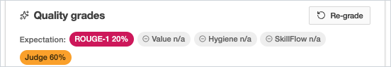

### The KPIs measured and tracked on every run

| KPI | What it tells you |
| --- | --- |
| **Turns** | How many model steps the session took |
| **Tool calls** | How many tools the model invoked |
| **Tokens in / out** | Provider-actual tokens sent and received |
| **Cost** | Estimated spend, per real model pricing |
| **Peak context** | The most context used — in tokens and as % of the model's limit |
| **Cached %** | Share of input served from prompt cache |
| **Tool errors** | Failed tool calls |
| **Duration** | Wall-clock time |
| **Outcome** | completed / aborted / stopped-by-guardrail / failed |
| **Quality** | The graded score |

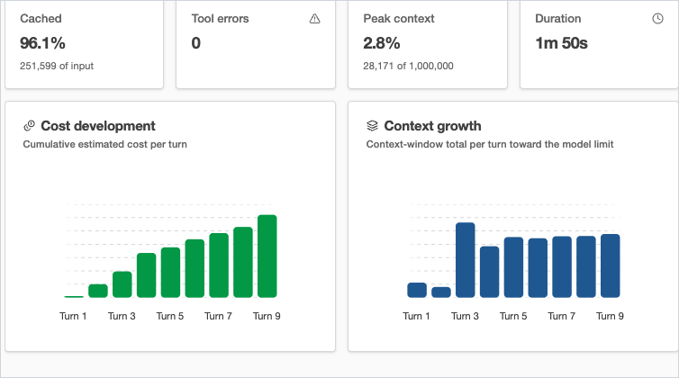

### Why this makes everything comparable

Because **every run carries the same KPIs and the same grades**, any two runs sit on identical axes.
A run today vs. a run last week. Model A vs. model B. A skill on vs. off. That shared, quantified
foundation is what makes the comparisons on the next page trustworthy instead of anecdotal.

---

## Compare anything, apples to apples

Put two runs (or a whole set) side by side and AI Workbench leads with a **plain-language verdict** —
*"+1.7% tokens, +4.2% cost — mixed, review before switching"* — then backs it with a delta matrix
across every KPI and grade, and overlaid context-window curves.

**See exactly where two sessions diverged.** The Flow view aligns both runs turn by turn and marks
what's the same and what changed — the step where one model called an extra tool, took a slower path,
or read a different skill file — right down to the final answers side by side.

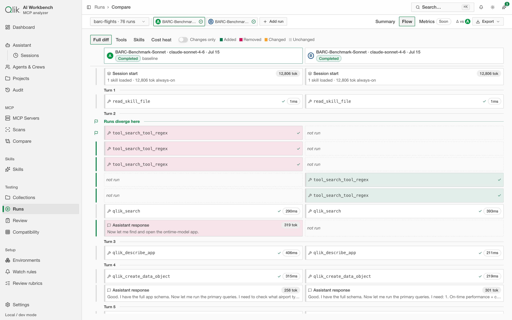

---

## The loop closes: fixes flow back to your skills

When a run fails or grades poorly and a skill was involved, AI Workbench doesn't just note it — it
**files a tracked issue against the skill itself**, with a severity, a plain-language explanation, a
**drafted fix**, and a link back to the exact run where it happened.

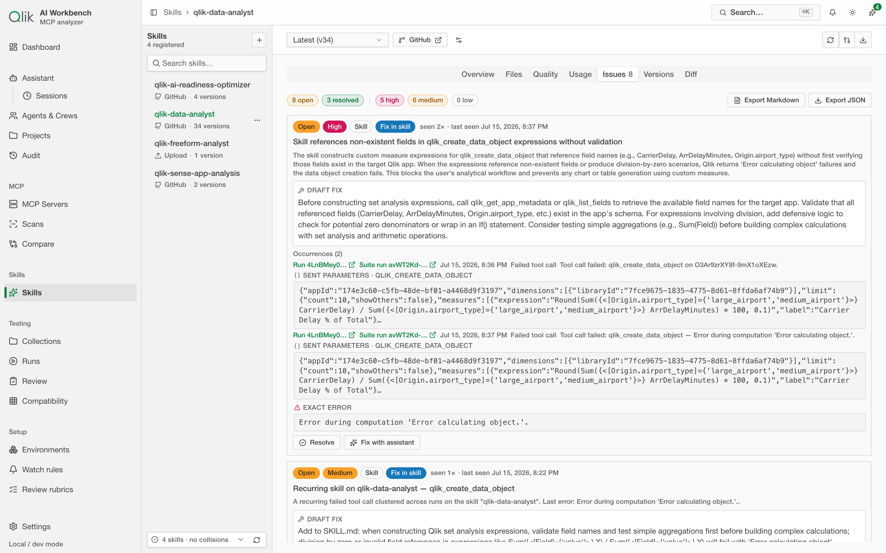

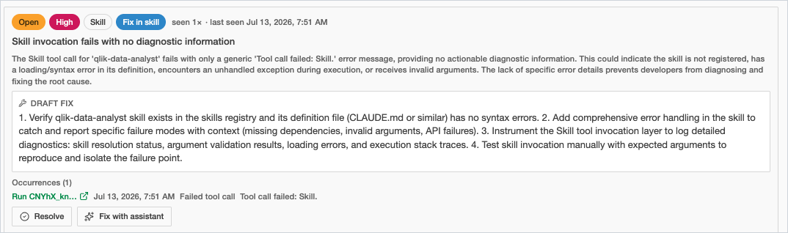

Resolve it yourself, or hand it to the built-in assistant with **Fix with assistant** — which edits
the skill and saves the result as a new immutable version, ready to re-test. That's the full loop: a
session surfaces a problem, the problem becomes a concrete issue with a fix, and the fix flows back
into a new version you can validate. Run it as a **long-running quality gate** and regressions get
caught before anyone else sees them.

---

## One workbench, your whole setup

Connect many servers, treat every model as an interchangeable run target, attach
skills, and manage it all from one place — with a clear operational overview across everything.

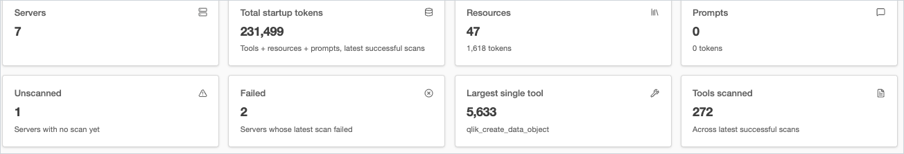

- **Real token counting** with production tokenizers plus fast estimate profiles.
- **A real agent loop**, multi-provider, with token/context accounting, cost estimates, and guardrails.
- **Automatic grading and issue detection** on every run — no setup required.
- **Comparison across time, models, and skills**, distilled to a verdict.
- **A Skills registry** with footprint, security surface, versioning, and the closed fix loop.
- **Fully local** — no accounts, no cloud, nothing sensitive ever leaves your machine.

---

## Ready to look closer?

The full walkthrough — connecting a server, reading a footprint, running and grading a session, and
comparing results — is in the [User Guide](./README.md).

*Built to run locally. Two themes (light and dark). Deep-linkable throughout.*
